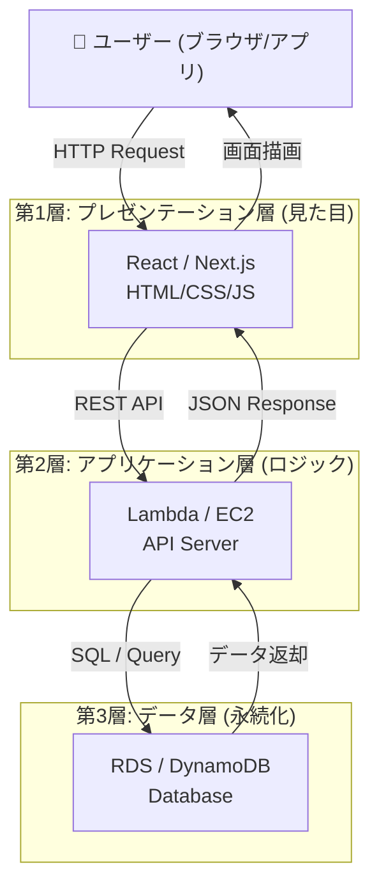
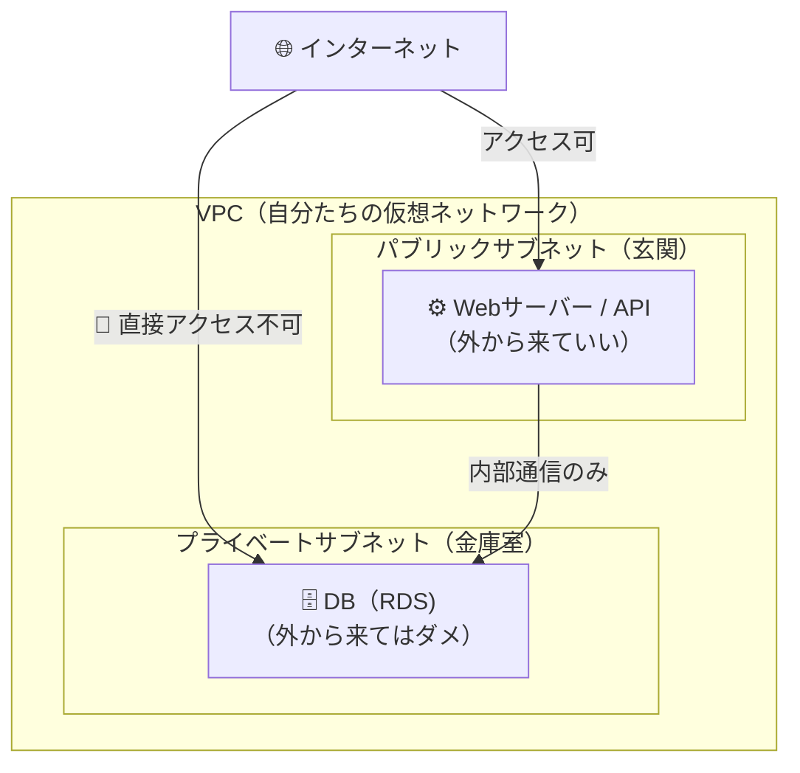
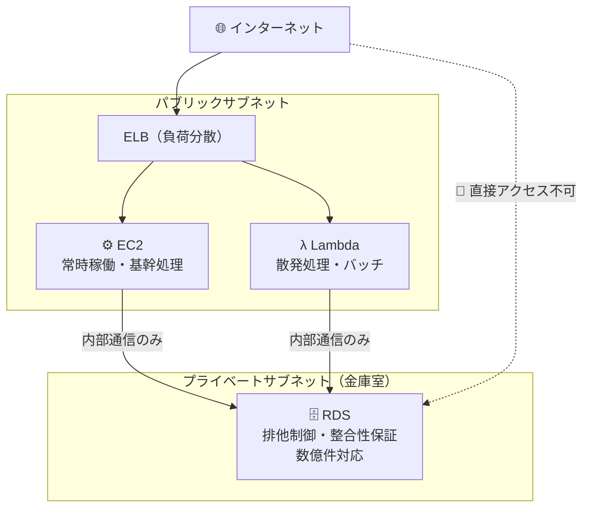

---

## 各層で理解すべきこと

### 🖥️ 第1層：プレゼンテーション層

**役割：** ユーザーが直接触れる部分。「見た目」と「入力受付」だけを担当する。

| 理解ポイント | 内容 |
|---|---|
| **責務の分離** | 画面表示のみ。ビジネスロジックをここに書かない |
| **AWS対応サービス** | S3（静的ホスティング）＋CloudFront（CDN配信） |
| **n8nとの対応** | n8nのUIダッシュボード ≒ この層に相当 |

**PMとして押さえる一言：**
> 「フロントエンドはS3+CloudFrontで配信することで、サーバー管理不要・グローバル低遅延を実現できます」

---

### ⚙️ 第2層：アプリケーション層（最重要）

**役割：** ビジネスロジックを実行する「頭脳」。第1層と第3層の橋渡し。

| 理解ポイント | 内容 |
|---|---|
| **APIとは何か** | フロントからのリクエストを受け取り、処理してDBに命令を出す窓口 |
| **AWS対応サービス** | EC2（常時起動）/ Lambda（イベント駆動・サーバーレス） |
| **n8nとの対応** | n8nのWorkflow（処理フロー）≒ この層のロジックに相当 |
| **スケーラビリティ** | ここにAuto Scaling / ELBを置いてトラフィックを分散する |

**EC2 vs Lambda の選び方（試験頻出）：**
```
常時リクエストがある → EC2（固定コスト、管理が必要）
散発的・短時間処理  → Lambda（従量課金、管理不要）
```

---

### 🗄️ 第3層：データ層

**役割：** データを永続的に保存・管理する。直接インターネットから触れさせない。

| 理解ポイント | 内容 |
|---|---|
| **スプシとの決定的違い** | 同時アクセス制御（排他制御）、インデックス、TB級データ対応 |
| **AWS対応サービス** | RDS（構造化・SQL）/ DynamoDB（NoSQL）/ S3（ファイル・ログ） |
| **セキュリティ** | **必ずプライベートサブネットに配置**（直接外部からアクセス不可） |

**RDS vs DynamoDB の選び方：**
```
テーブル間の関係がある（注文と顧客）→ RDS (MySQL/PostgreSQL)
シンプル・大量・高速なKey-Value     → DynamoDB
```


## なぜ「層を分ける」のか（設計思想）

これがPMとして最も説明できるべき本質です。

| メリット | 具体例 |
|---|---|
| **変更の影響を局所化** | デザイン変更でDBを触らなくていい |
| **スケールを層ごとに調整** | アクセス集中時にアプリ層だけ増やせる |
| **セキュリティ境界** | DBを外部から完全に隠蔽できる |
| **チームで並行開発** | フロント・バックエンド・DB担当が独立して作業できる |

---

## あなたのn8n経験との対応表

| n8n/スプシの世界 | 三層アーキテクチャの世界 |
|---|---|
| n8nのUIダッシュボード | プレゼンテーション層 (React) |
| n8nのWorkflow（処理フロー） | アプリケーション層 (Lambda/EC2) |
| n8nのWebhookエンドポイント | API Gateway |
| Googleスプレッドシート | データ層 (RDS) |
| スプシの行・列 | DBのレコード・カラム |

---

## 理解度チェック（自分でホワイトボードに書けるか？）

- [ ] 「ユーザーがフォームを送信してからDBに保存されるまで」の流れを図で書ける
- [ ] なぜDBはプライベートサブネットに置くのか、言葉で説明できる
- [ ] スプシとRDSの違いを顧客に3つ説明できる
- [ ] EC2とLambdaをどう使い分けるか、コスト・管理の観点で話せる

---


## ① なぜDBはプライベートサブネットに置くのか

### まず「サブネットの2種類」を理解する



### なぜ分けるのか？　一言で言うと

> **「DBには顧客の全データが入っているから、インターネットから直接触れる場所に置いてはいけない」**

### 具体的なリスクで考える

| もしDBをパブリックに置いたら… | 結果 |
|---|---|
| 攻撃者がDBのIPアドレスを発見 | SQLインジェクションで直接攻撃される |
| 推測可能なパスワードが設定されていた | 全顧客データが盗まれる |
| 設定ミスでポートが開放されていた | 気づかないまま不正アクセスされ続ける |

### プライベートサブネットにある安心感

- インターネットから**直接到達するルートが存在しない**（物理的に届かない）
- アプリサーバー（EC2）からの通信**だけ**許可する
- 万が一Webサーバーが乗っ取られても、DBへの侵入に**もう1段階の壁**がある

**PMとして使える一言：**
> 「DBをプライベートサブネットに置くことで、インターネットからの直接攻撃を構造的に遮断します。セキュリティ設定の『ミス』が起きても、DBへの経路自体が存在しないため、最悪の事態を防げます」

---

## ② スプシとRDSの違い（顧客向け説明）

### 前提：スプシで何が起きているか

n8nとスプシで業務システムを作ると、最初は動く。でも**データが増えると壊れ始める。**

### 違い① 同時アクセス（排他制御）

```
【スプシの世界】
営業Aさん：行15を編集中...
営業Bさん：同じ行15を上書き保存！
→ Aさんのデータが消える（上書き競合）

【RDSの世界】
営業Aさん：行15を編集中（ロックをかける）
営業Bさん：「編集中です。少し待ってください」と自動制御
→ データは必ず正しい状態を保つ
```

> **スプシは「一人で使う前提」で設計されている。RDSは「同時に何千人が使う前提」で設計されている。**

### 違い② データ量とスピード

| | スプシ | RDS |
|---|---|---|
| 現実的な上限 | 数万行で動作が重くなる | 数億件でも高速検索可能 |
| 検索の仕組み | 上から順番に全部見る（線形探索） | インデックスで一瞬で見つける（索引） |
| 具体的な差 | 5万件の検索：数秒〜フリーズ | 5万件の検索：数ミリ秒 |

**本の索引で例えると：**
> スプシ = 「目次のない本を最初のページから読む」
> RDS = 「索引ページで該当ページを一瞬で特定する」

### 違い③ データの整合性（壊れないこと）

```
【スプシの問題例】
・「受注テーブル」に顧客IDを手打ち → 存在しない顧客IDを入力しても誰も気づかない
・担当者がスプシの列を勝手に削除 → 全データが破損
・数式が壊れてもエラーが出ない → 間違った数字のまま業務が回る

【RDSが防ぐこと】
・外部キー制約：「存在しない顧客ID」は入力させない（DB側で強制）
・スキーマ定義：列の追加・削除は権限がないとできない
・トランザクション：「送金処理」の途中でエラーが起きたら全部なかったことにする
```

**PMとして使える一言：**
> 「スプレッドシートは個人の作業ツールです。RDSはチームで正確なデータを守るための仕組みです。データ件数が増えるほど、また複数人で使うほど、この差が業務リスクとして顕在化します」

---

## ③ EC2 vs Lambda：コスト・管理の使い分け

### まずイメージで理解する

```
EC2 = 「社員を一人雇う」
　→ 仕事があってもなくても、月給を払い続ける
　→ でも何をしてもらってもOK、いつでも即対応

Lambda = 「仕事があるときだけ呼ぶ外注さん」
　→ 仕事した分だけ支払う（仕事がなければゼロ円）
　→ ただし「1回の仕事は15分まで」などの制約あり
```

### コストの観点

| シナリオ | EC2 | Lambda |
|---|---|---|
| 24時間常にリクエストがある | ◎ 安定・割安 | △ 呼ばれ続けるのでむしろ高くなる |
| 1日数回しか処理が走らない | ✕ 無駄に課金され続ける | ◎ ほぼ無料に近い |
| トラフィックが読めない | △ 余裕を持たせると過剰コスト | ◎ 自動で増減、無駄がない |

### 管理の観点

| 作業 | EC2 | Lambda |
|---|---|---|
| OSのアップデート | 自分でやる必要あり | **不要**（AWSが管理） |
| セキュリティパッチ適用 | 自分でやる必要あり | **不要** |
| スケールアップ | 設定が必要 | **自動**（同時に何万でも実行） |
| サーバーの起動・停止管理 | 必要 | **不要**（コードだけ置けばいい） |

### 判断フローチャート

```
処理時間が15分以上かかる？
　→ YES：EC2一択（Lambdaは最大15分の制限あり）
　→ NO：次へ

常時リクエストが来る（Webサービス等）？
　→ YES：EC2が安定・コスト効率よい
　→ NO：次へ

散発的・イベント駆動（ファイルアップロード時に処理、夜間バッチ等）？
　→ YES：Lambda（使った分だけ課金、管理不要）
```

### n8n経験との対応

| n8nの世界 | AWSの対応 |
|---|---|
| n8nのWorkflowを「手動実行」 | Lambda（呼ばれたときだけ動く） |
| n8nを24時間起動してWebhook待受 | EC2（常時起動でリクエスト待ち） |
| n8nのスケジュールトリガー | Lambda＋EventBridge（定期実行） |

**PMとして使える一言：**
> 「常時稼働が必要な基幹処理はEC2、夜間バッチや通知処理などの散発的な処理はLambdaと使い分けることで、管理コストと費用を同時に最適化できます」

---

## まとめ：3つの概念を一枚の図に



---

