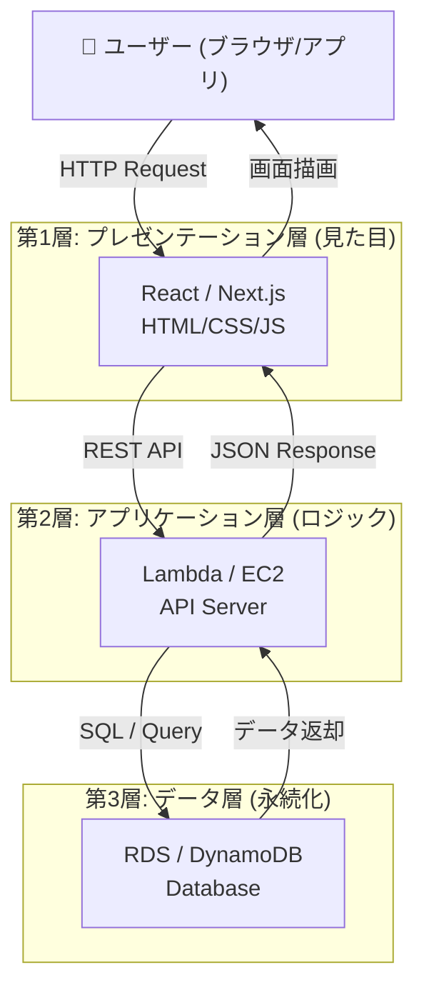

---

## 各層で理解すべきこと

### 🖥️ 第1層：プレゼンテーション層

**役割：** ユーザーが直接触れる部分。「見た目」と「入力受付」だけを担当する。

| 理解ポイント | 内容 |
|---|---|
| **責務の分離** | 画面表示のみ。ビジネスロジックをここに書かない |
| **AWS対応サービス** | S3（静的ホスティング）＋CloudFront（CDN配信） |
| **n8nとの対応** | n8nのUIダッシュボード ≒ この層に相当 |

**PMとして押さえる一言：**
> 「フロントエンドはS3+CloudFrontで配信することで、サーバー管理不要・グローバル低遅延を実現できます」

---

### ⚙️ 第2層：アプリケーション層（最重要）

**役割：** ビジネスロジックを実行する「頭脳」。第1層と第3層の橋渡し。

| 理解ポイント | 内容 |
|---|---|
| **APIとは何か** | フロントからのリクエストを受け取り、処理してDBに命令を出す窓口 |
| **AWS対応サービス** | EC2（常時起動）/ Lambda（イベント駆動・サーバーレス） |
| **n8nとの対応** | n8nのWorkflow（処理フロー）≒ この層のロジックに相当 |
| **スケーラビリティ** | ここにAuto Scaling / ELBを置いてトラフィックを分散する |

**EC2 vs Lambda の選び方（試験頻出）：**
```
常時リクエストがある → EC2（固定コスト、管理が必要）
散発的・短時間処理  → Lambda（従量課金、管理不要）
```

---

### 🗄️ 第3層：データ層

**役割：** データを永続的に保存・管理する。直接インターネットから触れさせない。

| 理解ポイント | 内容 |
|---|---|
| **スプシとの決定的違い** | 同時アクセス制御（排他制御）、インデックス、TB級データ対応 |
| **AWS対応サービス** | RDS（構造化・SQL）/ DynamoDB（NoSQL）/ S3（ファイル・ログ） |
| **セキュリティ** | **必ずプライベートサブネットに配置**（直接外部からアクセス不可） |

**RDS vs DynamoDB の選び方：**
```
テーブル間の関係がある（注文と顧客）→ RDS (MySQL/PostgreSQL)
シンプル・大量・高速なKey-Value     → DynamoDB
