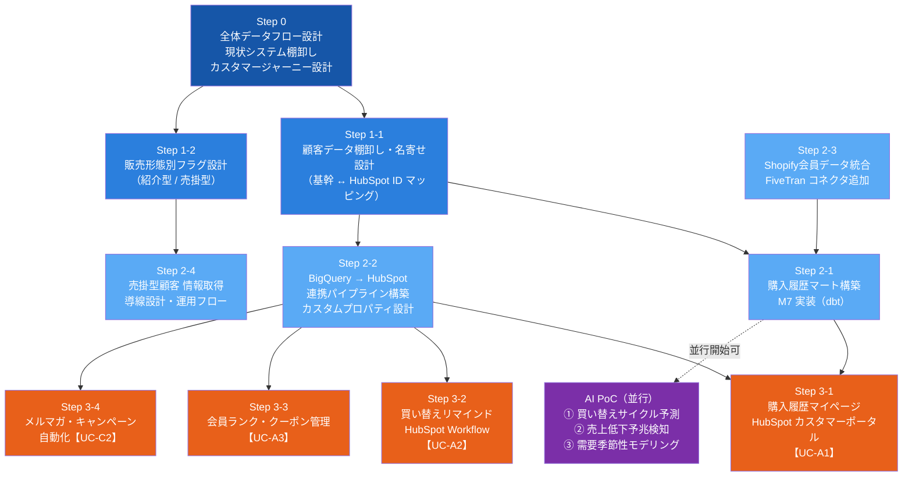
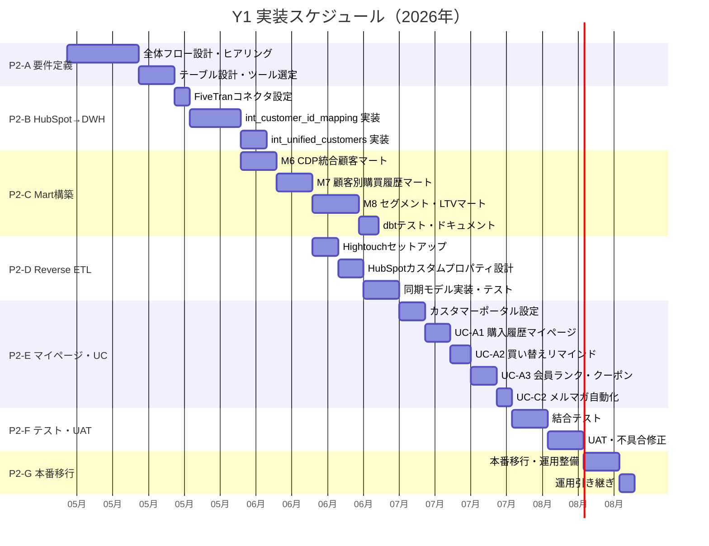
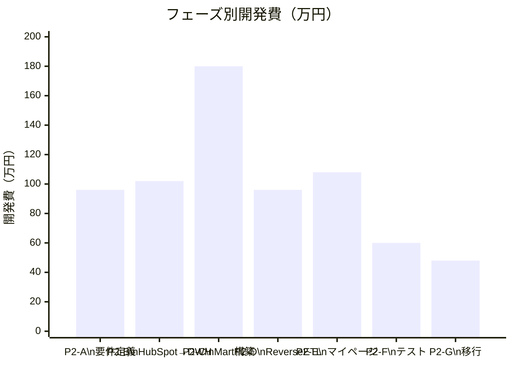
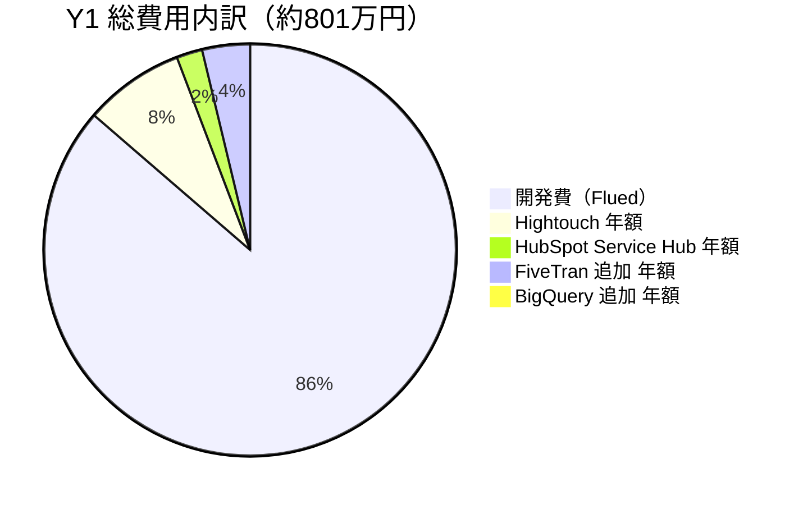
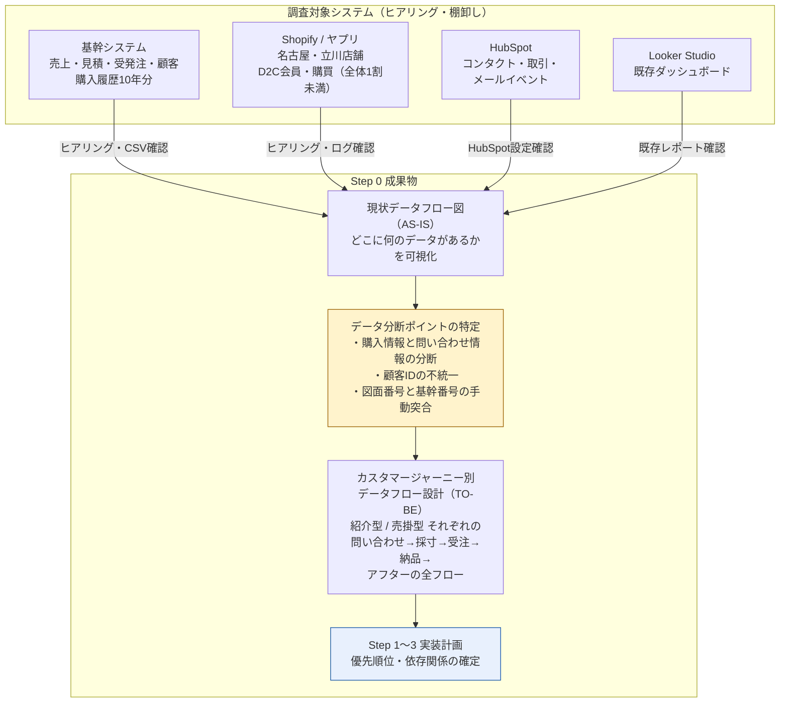
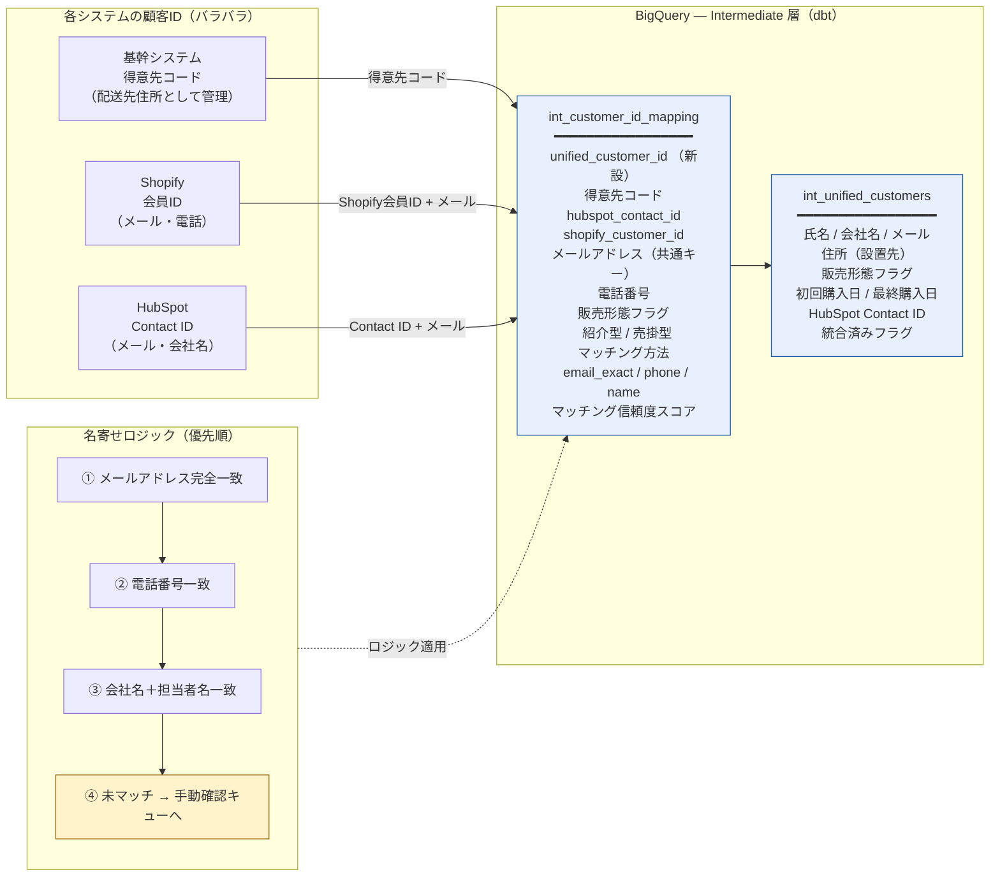
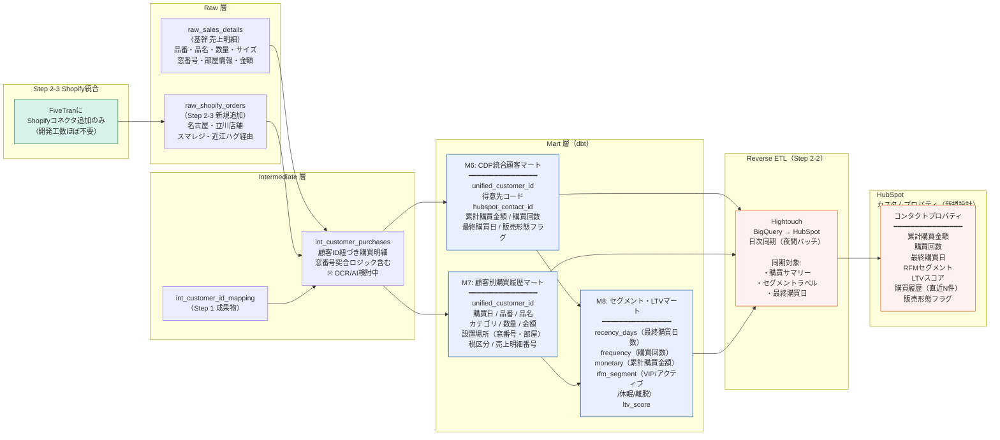
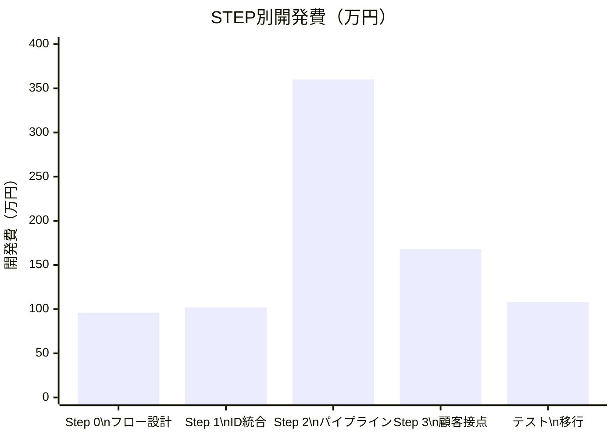

```mermaid
flowchart TD
    subgraph DATA["Step 2 の成果（入力データ）"]
        D1["HubSpotコンタクトプロパティ\n購買サマリー・セグメント・LTV"]
        D2["M7 購買履歴マート\n（Hightouch経由でHubSpotに格納）"]
    end

    subgraph S31["Step 3-1 — UC-A1\n購入履歴マイページ"]
        P1["HubSpot\nカスタマーポータル\n（Service Hub Professional）"]
        P2["顧客ログイン画面\nメール + パスワード認証"]
        P3["マイページ表示\n・購入履歴一覧\n  購入日 / 品名 / サイズ / 金額\n・設置場所・窓番号情報\n・購買サマリーカード\n  累計金額 / 購買回数 / 最終購買日\n・モバイル対応"]
        P1 --> P2 --> P3
    end

    subgraph S32["Step 3-2 — UC-A2\n買い替えリマインド"]
        W1["HubSpot Workflow\nトリガー設定"]
        W2["条件:\n最終購入日から N年経過\n（年数はJIAS様が定義）\n対象: 紹介型顧客\n+ 買い替え問い合わせ歴\nありの売掛型顧客"]
        W3["自動メール配信\nパーソナライズ内容:\n・購入商品名・設置場所\n・買い替え提案\n・ショールーム案内"]
        W1 --> W2 --> W3
    end

    subgraph S33["Step 3-3 — UC-A3\n会員ランク・クーポン"]
        R1["セグメント定義\n（M8 RFMベース）\nVIP / アクティブ / 一般 / 休眠"]
        R2["HubSpotリスト\n（アクティブリスト）\nプロパティ変化で自動更新"]
        R3["ランク別クーポン配信\n・VIP: 限定オファー\n・アクティブ: 季節提案\n・休眠: 再エンゲージメント"]
        R1 --> R2 --> R3
    end

    subgraph S3C["Step 3-4 — UC-C2\nメルマガ・キャンペーン自動化"]
        M1["HubSpot Marketing Hub\n（既存契約活用）"]
        M2["セグメント別配信設定\n購買履歴・季節・\nイベントに連動した\nキャンペーンメール"]
        M3["送信・開封・クリック\nデータがHubSpotに蓄積\n→ Y2以降のAI活用の素材"]
        M1 --> M2 --> M3
    end

    D1 --> S31
    D1 --> S32
    D1 --> S33
    D2 --> S31
    D1 --> S3C

    style S31 fill:#FFF2EE,stroke:#E8601A
    style S32 fill:#FFF2EE,stroke:#E8601A
    style S33 fill:#FFF2EE,stroke:#E8601A
    style S3C fill:#FFF2EE,stroke:#E8601A
```

# JIAS Phase2 CDP — Y1 費用試算書

**対象:** JIAS様 CDP構築プロジェクト Phase2 / Y1（2026年度）
**作成日:** 2026年4月13日
**作成者:** 株式会社Flued

---

## 1. Y1 スコープ概要

Y1（2026年度）は **「基盤整備 + 初期活用フェーズ」** と位置づける。
購買データとHubSpotをつなぐ全体パイプラインを構築し、主要ユースケース（マイページ・リマインド・会員ランク・メルマガ自動化）を先行着手する。

| # | Y1 実施内容 | 対応UC |
|---|------------|--------|
| Step 0 | 全体データフロー設計・現状棚卸し | — |
| Step 1 | 顧客ID統合設計（名寄せ・マッピング） | — |
| Step 2 | 購入データ → HubSpot 連携パイプライン構築 | — |
| Step 3-1 | 購入履歴マイページ（ログインポータル） | UC-A1 |
| Step 3-2 | 買い替えリマインド自動配信 | UC-A2 |
| Step 3-3 | 会員ランク・クーポン管理 | UC-A3 |
| Step 3-4 | メルマガ・キャンペーン自動化 | UC-C2 |
| AI PoC | 買い替えサイクル予測・売上低下予兆・需要季節性モデリング（3テーマ） | — |

> Y2以降: UC-B1（営業向け顧客サマリー）、UC-B2（売上低下アラート）、UC-A4（レコメンド）、UC-C1（休眠顧客掘り起こし）

---

## 2. システムアーキテクチャ

### 2.1 全体データフロー

```mermaid
flowchart LR
    subgraph SRC["データソース"]
        A1["基幹システム\n（売上・顧客・商品）"]
        A2["Shopify\n（名古屋・立川店舗）"]
        A3["HubSpot CRM\n（コンタクト・取引・\nメールイベント）"]
    end

    subgraph ETL["収集・変換層"]
        B1["FiveTran\n（既存コネクタ）"]
        B2["FiveTran\n（HubSpot コネクタ追加）"]
        B3["FiveTran\n（Shopify コネクタ追加）"]
    end

    subgraph BQ["BigQuery DWH"]
        subgraph RAW["Raw 層"]
            C1["raw_sales / raw_customers\n（既存）"]
            C2["raw_hubspot_contacts\nraw_hubspot_companies\nraw_hubspot_deals\nraw_hubspot_email_events\n（新規）"]
            C3["raw_shopify_orders\n（新規）"]
        end
        subgraph INT["Intermediate 層（dbt）"]
            D1["int_customer_id_mapping\n【顧客ID名寄せ】\n基幹コード ↔ HubSpot Contact ID"]
            D2["int_unified_customers\n【統合顧客テーブル】"]
            D3["int_customer_purchases\n【顧客別購買明細】"]
        end
        subgraph MART["Mart 層（dbt）"]
            E1["M1〜M5\n（既存マート継続）"]
            E2["M6: CDP統合顧客マート\n（新規）"]
            E3["M7: 顧客別購買履歴マート\n（新規）"]
            E4["M8: 顧客セグメント・LTVマート\n（新規・RFM計算含む）"]
        end
    end

    subgraph RETL["Reverse ETL"]
        F1["Hightouch\n（BigQuery → HubSpot 同期）"]
    end

    subgraph HUB["HubSpot"]
        G1["コンタクトプロパティ\n（購買サマリー・セグメント更新）"]
        G2["カスタマーポータル\n（マイページ / UC-A1）"]
        G3["Workflow 自動化\n（買い替えリマインド / UC-A2）"]
        G4["会員ランク・クーポン\n（UC-A3）"]
        G5["メルマガ・MA\n（UC-C2）"]
    end

    subgraph OUT["アウトプット"]
        H1["Looker Studio\n（既存ダッシュボード継続\n+ CDP分析追加）"]
        H2["顧客マイページ\n（エンドユーザー閲覧）"]
        H3["マーケティング施策\n（メール・クーポン配信）"]
    end

    A1 --> B1
    A2 --> B3
    A3 --> B2
    B1 --> C1
    B2 --> C2
    B3 --> C3
    C1 --> D1
    C2 --> D1
    C3 --> D2
    D1 --> D2
    D2 --> D3
    D3 --> E2
    D3 --> E3
    E2 --> E4
    E3 --> E4
    E1 --> H1
    E2 --> F1
    E3 --> F1
    E4 --> F1
    E4 --> H1
    F1 --> G1
    G1 --> G2
    G1 --> G3
    G1 --> G4
    G1 --> G5
    G2 --> H2
    G3 --> H3
    G4 --> H3
    G5 --> H3
```

### 2.2 実装ステップ（依存関係）

---

## 3. 工数見積

### 3.1 フェーズ別工数

| フェーズ | 内容 | Flued\n（人日） | JIAS\n（人日） | 合計\n（人日） | 期間目安 |
|---------|------|:-----------:|:----------:|:-----------:|:-------:|
| **P2-A** | 要件定義・設計・全体フロー設計（Step 0） | 8.0 | 2.0 | 10.0 | 2週間 |
| **P2-B** | HubSpot→DWH連携構築（Step 1 〜 Step 2-2） | 8.5 | 1.5 | 10.0 | 2週間 |
| **P2-C** | 新規Mart構築 M6〜M8（dbt） | 15.0 | 1.0 | 16.0 | 3週間 |
| **P2-D** | Reverse ETL構築（Hightouch セットアップ・同期モデル） | 8.0 | 1.0 | 9.0 | 2週間 |
| **P2-E** | マイページ構築・Workflow設定（Step 3 全UC） | 9.0 | 2.0 | 11.0 | 2週間 |
| **P2-F** | テスト・UAT | 5.0 | 3.0 | 8.0 | 2週間 |
| **P2-G** | 本番移行・運用整備・引き継ぎ | 4.0 | 1.0 | 5.0 | 1週間 |
| **合計** | | **57.5** | **11.5** | **69.0** | **約3.5ヶ月** |

> ※ JIAS工数（11.5人日）は社内対応分のため開発費には含まない。

### 3.2 スケジュール（Gantt）

---

## 4. 開発費試算

### 4.1 前提単価

| 区分 | 単価 | 備考 |
|------|------|------|
| Flued エンジニア | ¥120,000 / 人日 | シニアエンジニア想定 |
| Flued コンサル | ¥120,000 / 人日 | 要件定義・設計・UAT支援含む |

### 4.2 フェーズ別開発費

| フェーズ | Flued工数 | 単価 | 開発費 |
|---------|:---------:|------|-------:|
| P2-A 要件定義・設計 | 8.0人日 | ¥120,000 | ¥960,000 |
| P2-B HubSpot→DWH連携 | 8.5人日 | ¥120,000 | ¥1,020,000 |
| P2-C Mart構築（M6〜M8） | 15.0人日 | ¥120,000 | ¥1,800,000 |
| P2-D Reverse ETL構築 | 8.0人日 | ¥120,000 | ¥960,000 |
| P2-E マイページ・UC構築 | 9.0人日 | ¥120,000 | ¥1,080,000 |
| P2-F テスト・UAT | 5.0人日 | ¥120,000 | ¥600,000 |
| P2-G 本番移行・運用整備 | 4.0人日 | ¥120,000 | ¥480,000 |
| **合計** | **57.5人日** | | **¥6,900,000** |

---

## 5. ツール・サービス月額費用

### 5.1 新規追加ツール

| ツール / サービス | プラン | 月額（目安） | 年額（目安） | 備考 |
|----------------|------|:----------:|:----------:|------|
| **Hightouch**（Reverse ETL） | Starter | ¥52,500 | ¥630,000 | $350/月（¥150/$換算）。同期先・行数により変動 |
| **HubSpot Service Hub** | Professional | ¥13,500 | ¥162,000 | $90/月/シート。カスタマーポータルに必須 |
| **FiveTran**（HubSpotコネクタ追加） | 既存プラン追加 | ¥25,000 | ¥300,000 | プランによっては既存範囲内の可能性あり |
| **BigQuery**（追加ストレージ） | On-demand | ¥4,000 | ¥48,000 | HubSpot Raw層データ追加分 |
| **合計（新規分）** | | **¥94,500** | **¥1,140,000** | |

### 5.2 既存継続ツール（参考）

| ツール | 月額（概算） | 備考 |
|-------|:----------:|------|
| FiveTran（既存コネクタ） | 既存契約 | Phase1からの継続 |
| BigQuery（既存） | 既存契約 | ストレージ・クエリ費用 |
| dbt Cloud | 既存契約 | モデル追加のみ（追加費用なし） |
| Looker Studio | 無料 | 継続 |
| HubSpot Marketing Hub | 既存契約 | UC-C2のメルマガ配信に活用 |

---

## 6. Y1 費用サマリー

### 6.1 初期開発費 + 年間ツール費

| 費用区分 | 金額 | 備考 |
|---------|-----:|------|
| **開発費（初期）** | **¥6,900,000** | Flued 57.5人日分 |
| **ツール費（年額）** | **¥1,140,000** | 新規追加ツール12ヶ月分 |
| **Y1 合計** | **¥8,040,000** | 税別 |

### 6.2 稼働後の月額ランニングコスト

| 費用区分 | 月額 | 備考 |
|---------|-----:|------|
| Hightouch | ¥52,500 | 同期量により変動 |
| HubSpot Service Hub | ¥13,500 | ユーザー数による |
| FiveTran 追加分 | ¥25,000 | プラン次第で0円の場合あり |
| BigQuery 追加分 | ¥4,000 | データ量次第 |
| **月額合計** | **¥95,000** | |

### 6.3 代替構成（コスト削減オプション）

Hightouchの代わりに **Google Cloud Functions + HubSpot API** でカスタム実装する場合：

| 項目 | Hightouch構成 | Cloud Functions構成 | 差分 |
|-----|:------------:|:-------------------:|:----:|
| Reverse ETL ツール費（年） | ¥630,000 | ¥12,000 | **▲¥618,000** |
| 追加開発工数 | — | +8人日 | +¥960,000 |
| 運用保守性 | 高（GUI管理） | 低（コード管理） | — |
| **実質差額** | | | **▲¥342,000/年** |

> コスト削減は約34万円/年。ただし運用工数・障害対応リスクを考慮するとHightouch推奨。

---

## 7. 前提条件・リスク

### 前提条件

| # | 前提条件 |
|---|---------|
| 1 | HubSpot が Marketing Hub Professional 以上であること（FiveTran コネクタ対応） |
| 2 | HubSpot Service Hub Professional が契約されること（カスタマーポータル利用に必須） |
| 3 | 基幹システムの顧客データとHubSpotコンタクトにメールアドレス等の共通キーが一定数存在すること |
| 4 | Phase1 の BigQuery / FiveTran / dbt 基盤が安定稼働していること |
| 5 | 基幹システムの「図面上の窓番号」と「基幹システム番号」の突合方式が確定していること |

### リスクと対策

| リスク | 影響度 | 対策 |
|--------|:-----:|------|
| 顧客IDマッチング率が低い（共通キーが少ない） | 高 | Step 0でサンプルデータを先行確認。手動マッチング運用フローを設計 |
| HubSpotプランが不足（Service Hub非契約） | 高 | 要件定義前にプラン確認・アップグレード費用を別途見積もり |
| Hightouch費用が想定超過（大量データ同期） | 中 | 同期対象を直近2年分・サマリーに絞る。全履歴はマイページリンクで対応 |
| 基幹データの購入履歴構造が複雑（図面番号突合） | 中 | AI/OCR活用の可能性を検討。Step 2-1で先行調査を実施 |
| カスタマーポータルのUI表示にCMS Hubが必要なケース | 低 | 機能範囲を事前確認。必要に応じてCMS Hub追加見積もりを提示 |

---

## 8. STEP別 詳細見積・アーキテクチャ提案

> 各STEPの見積根拠・技術構成・依存関係を示す。単価前提: Flued ¥120,000/人日（税別）。

---

### Step 0 — 全体データフロー設計

#### アーキテクチャ

#### 工数内訳と根拠

| サブステップ | 作業内容 | Flued | JIAS | 根拠 |
|------------|---------|:-----:|:----:|------|
| Step 0-1 | 既存システム・データ全量棚卸し（基幹・Shopify・HubSpot各システムのデータ構造調査、AS-ISフロー図作成） | 3.0d | 1.0d | システム数5つ × ヒアリング+調査各0.5d、フロー図作成1d |
| Step 0-1 | データ分断ポイント特定・課題整理 | 1.0d | 0.5d | 棚卸し結果のレビュー・課題定義 |
| Step 0-2 | カスタマージャーニー別データフロー設計（TO-BE）紹介型・売掛型の2パターン | 3.0d | 0.5d | パターン2種 × 設計1.5d。オペレーションフロー含む |
| Step 0-2 | 設計レビュー・JIAS承認・Step 1〜3計画確定 | 1.0d | — | レビューMTG + 修正対応 |
| **小計** | | **8.0d** | **2.0d** | |

| 費用項目 | 金額 |
|---------|-----:|
| Flued 開発・設計費（8.0人日） | ¥960,000 |
| **Step 0 合計** | **¥960,000** |

> **根拠補足:** Step 0は独立したコンサルティングプロジェクト相当の規模になり得る。基幹システムの構造が複雑な場合（10年分の購入履歴・図面番号の手動突合など）は+2〜3人日のバッファが必要。JIAS様のヒアリング協力が品質を大きく左右する。

---

### Step 1 — 顧客ID統合設計

#### アーキテクチャ

#### 工数内訳と根拠

| サブステップ | 作業内容 | Flued | JIAS | 根拠 |
|------------|---------|:-----:|:----:|------|
| Step 1-1 | データ棚卸し・名寄せキー設計（メール/電話/会社名の共通キー特定、サンプルデータでマッチング率先行確認） | 2.0d | 1.0d | サンプル確認 0.5d + 設計 1.0d + 修正 0.5d |
| Step 1-1 | `int_customer_id_mapping` dbt実装（名寄せロジック3段階 + 信頼度スコア + 手動確認キュー） | 3.0d | — | ロジック複雑度高。段階マッチング + テスト込み |
| Step 1-1 | `int_unified_customers` dbt実装 | 2.0d | — | 基幹 + HubSpot + Shopifyの3ソース結合 |
| Step 1-2 | 販売形態フラグ設計・実装（紹介型/売掛型の判別ロジック、売掛型の情報取得タイミング設計） | 1.5d | 0.5d | 運用設計含む。JIAS様の業務フロー確認が必要 |
| **小計** | | **8.5d** | **1.5d** | |

| 費用項目 | 金額 |
|---------|-----:|
| Flued 開発・設計費（8.5人日） | ¥1,020,000 |
| **Step 1 合計** | **¥1,020,000** |

> **根拠補足:** 名寄せ精度はStep 2〜3の全UCの品質を直接左右する最重要工程。基幹システムが「配送先住所」として顧客情報を持っている前提のため、メールアドレスが存在しないレコードが多い可能性があり、その場合はStep 1-2の運用設計（売掛型の導線）が手戻りなく進むための追加設計が必要になる。

---

### Step 2 — 購入データ → HubSpot 連携パイプライン

#### アーキテクチャ

#### 工数内訳と根拠

| サブステップ | 作業内容 | Flued | JIAS | 根拠 |
|------------|---------|:-----:|:----:|------|
| Step 2-1 | `int_customer_purchases` 実装（売上明細 + 顧客ID結合。窓番号突合ロジック含む） | 3.0d | — | 基幹データの構造複雑度を考慮。OCR検討分は別途 |
| Step 2-1 | M6 CDP統合顧客マート（dbt）実装 + テスト | 4.0d | — | 3ソース結合 + RFM計算の前処理込み |
| Step 2-1 | M7 顧客別購買履歴マート（dbt）実装 + テスト | 4.0d | — | 購買明細の正規化・設置場所情報の整理 |
| Step 2-1 | M8 セグメント・LTVマート（RFM計算）実装 + テスト | 5.0d | — | RFMロジック設計・セグメント定義はJIAS様と協議が必要 |
| Step 2-1 | dbtテスト・ドキュメント整備 | 2.0d | 1.0d | not_null / unique / IDマッチング率テスト |
| Step 2-2 | Hightouchセットアップ（BigQuery接続・HubSpot接続） | 2.0d | — | 初期設定 + 認証 + 接続確認 |
| Step 2-2 | HubSpotカスタムプロパティ設計・作成（購買サマリー・セグメント） | 2.0d | 1.0d | プロパティ数10〜15個想定。JIAS様確認必要 |
| Step 2-2 | Hightouch同期モデル実装（M6購買サマリー → Contact） | 2.0d | — | 同期条件・差分更新ロジック設計 |
| Step 2-2 | Hightouch同期モデル実装（M8セグメント → Contact） | 1.5d | — | セグメント値のマッピング設計 |
| Step 2-2 | 同期テスト・データ確認（日次バッチ動作確認） | 1.5d | — | ステージング環境での動作確認 |
| Step 2-3 | FiveTran Shopifyコネクタ追加・接続確認 | 1.0d | — | コネクタ設定のみ。開発工数最小 |
| Step 2-4 | 売掛型顧客 情報取得導線設計（HubSpot入力フォーム・受付票デジタル化検討） | 2.0d | — | 運用フロー設計込み |
| **小計** | | **30.0d** | **2.0d** | |

| 費用項目 | 金額 |
|---------|-----:|
| Flued 開発費（30.0人日） | ¥3,600,000 |
| Hightouch 初期セットアップ（ツール費初月） | ¥52,500 |
| **Step 2 合計（初期）** | **¥3,652,500** |

> **根拠補足:** Step 2が最大工数フェーズ。M6〜M8のdbt実装（15d）はデータ品質に直結するため、テスト・ドキュメントに2dを確保している。Hightouch(Step 2-2)はGUI管理で同期ロジックが可視化できるため、運用引き継ぎコストが低く選定。窓番号と基幹番号の自動突合にAI/OCRを導入する場合は+5〜8人日の別途見積もりが必要。

---

### Step 3 — HubSpot 顧客接点の活用

#### アーキテクチャ

#### 工数内訳と根拠

| サブステップ | 作業内容 | Flued | JIAS | 根拠 |
|------------|---------|:-----:|:----:|------|
| Step 3-1 | カスタマーポータル有効化・初期設定（Service Hub設定、ドメイン・ブランド設定） | 1.0d | — | HubSpot標準機能。設定作業中心 |
| Step 3-1 | 購入履歴表示ページ設計・実装（HubSpot CRMオブジェクト活用、購買履歴一覧・設置場所情報表示） | 3.0d | — | 表示項目設計 1d + 実装 1.5d + 調整 0.5d |
| Step 3-1 | 購買サマリーカード実装（累計金額・購買回数・最終購買日） | 1.0d | — | プロパティ表示設定 |
| Step 3-1 | 初回ログイン招待メール設定・パスワードリセットフロー確認 | 1.0d | — | HubSpot標準ワークフロー活用 |
| Step 3-1 | UIカスタマイズ（ブランドカラー・ロゴ）・モバイル表示確認 | 1.0d | 1.0d | JIAS様のブランドガイドライン確認必要 |
| Step 3-2 | 買い替えリマインドWorkflow設計（トリガー条件・対象セグメント・メール内容） | 1.5d | 0.5d | 対象年数・セグメント定義はJIAS様と協議 |
| Step 3-2 | Workflowメールテンプレート作成・設定 | 1.0d | 0.5d | HTMLメール or HubSpotデザインツール |
| Step 3-3 | 会員ランク定義・HubSpotアクティブリスト設定 | 1.5d | — | RFMセグメント4区分のリスト設定 |
| Step 3-3 | ランク別クーポン配信Workflow設計・実装 | 1.5d | — | 特典内容はJIAS様が定義 |
| Step 3-4 | メルマガ・キャンペーン自動化設定（HubSpot Marketing Hub活用、セグメント別配信設定） | 1.5d | — | 既存Marketing Hub契約活用のため追加開発最小 |
| Step 3-4 | 配信テンプレート作成・初回配信テスト | 1.0d | — | |
| **小計** | | **14.0d** | **2.0d** | |

| 費用項目 | 金額 |
|---------|-----:|
| Flued 開発費（14.0人日） | ¥1,680,000 |
| HubSpot Service Hub Professional（初月） | ¥13,500 |
| **Step 3 合計（初期）** | **¥1,693,500** |

> **根拠補足:** Step 3はHubSpotの標準機能を最大限活用するため、カスタム開発は最小限に抑えられる。ただしStep 3-1（マイページ）はShopify側の会員ログインとの連携方式がStep 1の設計結果に依存するため、Step 1完了前に着手すると手戻りのリスクがある。メールテンプレートのコピー・デザインはJIAS様の協力が必要。

---

### テスト・本番移行（P2-F + P2-G）

#### 工数内訳と根拠

| 作業内容 | Flued | JIAS | 根拠 |
|---------|:-----:|:----:|------|
| 結合テスト（データ取込 → Mart → 逆連携 → マイページ表示の全経路確認） | 3.0d | — | 経路数：FiveTran→BQ→dbt→Hightouch→HubSpot→Portal |
| UAT（JIAS担当者によるマイページ・Workflow動作確認） | — | 2.0d | 実ユーザー操作確認 |
| UAT（マーケ担当者によるセグメント・配信設定確認） | — | 1.0d | |
| 不具合修正対応 | 2.0d | — | UAT想定不具合 3〜5件 × 修正0.4d |
| 本番環境への移行作業 | 1.5d | — | ステージング→本番のデプロイ |
| 顧客へのマイページ案内メール設定 | — | 1.0d | JIAS様が内容確定・送信 |
| 運用マニュアル作成（日次バッチ確認・Hightouch・HubSpot操作手順） | 1.5d | — | 各ツール1章ずつ想定 |
| 運用引き継ぎMTG | 1.0d | — | |
| **小計** | **9.0d** | **4.0d** | |

| 費用項目 | 金額 |
|---------|-----:|
| Flued 開発費（9.0人日） | ¥1,080,000 |
| **テスト・移行 合計** | **¥1,080,000** |

---

### STEP別費用サマリー

| STEP | 内容 | Flued工数 | 開発費 | ツール初期費 | 小計 |
|------|------|:---------:|-------:|:-----------:|-----:|
| Step 0 | 全体データフロー設計 | 8.0人日 | ¥960,000 | — | **¥960,000** |
| Step 1 | 顧客ID統合設計 | 8.5人日 | ¥1,020,000 | — | **¥1,020,000** |
| Step 2 | 購入データ→HubSpot連携 | 30.0人日 | ¥3,600,000 | ¥52,500 | **¥3,652,500** |
| Step 3 | HubSpot顧客接点活用 | 14.0人日 | ¥1,680,000 | ¥13,500 | **¥1,693,500** |
| P2-F/G | テスト・本番移行 | 9.0人日 | ¥1,080,000 | — | **¥1,080,000** |
| **合計** | | **69.5人日** | **¥8,340,000** | **¥66,000** | **¥8,406,000** |

> ※ 工数合計が57.5dから69.5dに増加している理由: Step 2のサブステップ詳細化（2-3 Shopify統合・2-4 売掛型導線設計）とStep 3の各UC工数を改めて積み上げた結果。精緻な見積もりとしてこちらを推奨。

---

## 改訂履歴

| 版数 | 日付 | 改訂内容 | 作成者 |
|-----|------|---------|-------|
| 1.0 | 2026/04/13 | 初版作成 | 株式会社Flued |
| 1.1 | 2026/04/13 | STEP別詳細見積・アーキテクチャ追加 | 株式会社Flued |
