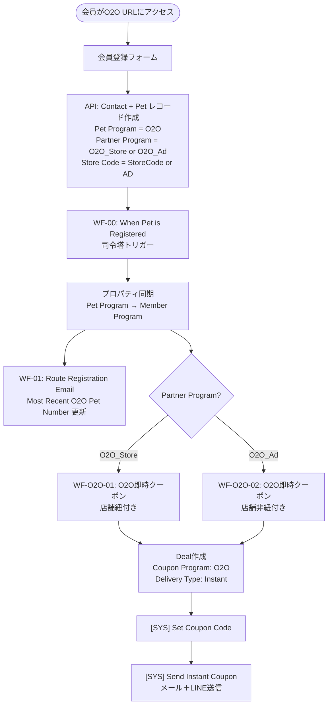
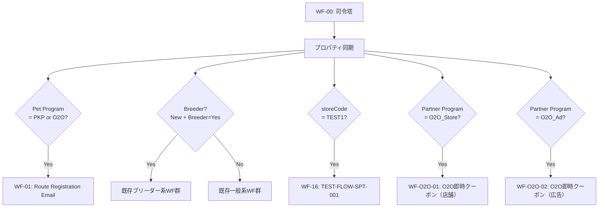
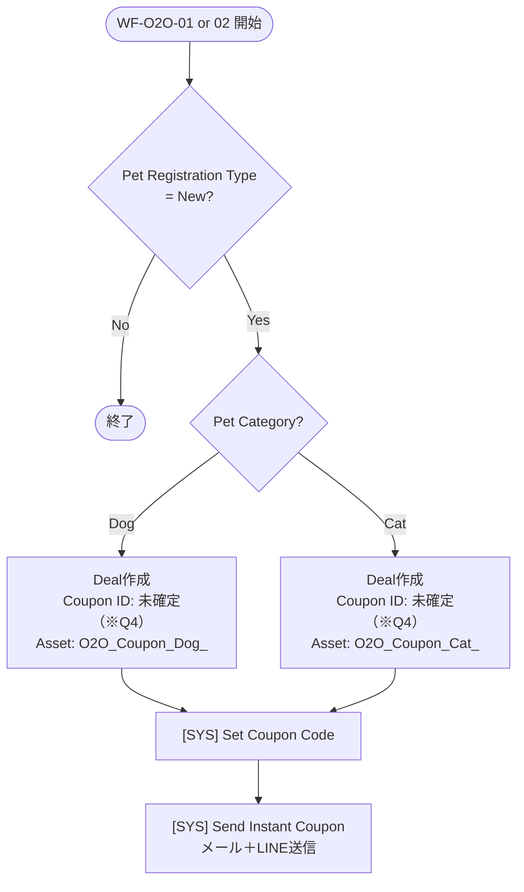

# 新規O2Oスキーマ 設計書

> 現行メンバーポータル＋HubSpot前提。アプリ仕様確定後に再調整予定。
> 作成日: 2026-03-18
> ステータス: たたき台（未確定事項あり）

---

## 目次

1. [設計方針](#1-設計方針)
2. [HubSpotデータ設計](#2-hubspotデータ設計)
3. [登録フロー](#3-登録フロー)
4. [ワークフロー設計](#4-ワークフロー設計)
5. [クーポン設計](#5-クーポン設計)
6. [未確定事項（先方確認待ち）](#6-未確定事項先方確認待ち)

---

## 1. 設計方針

### 1.1 基本方針

- PKP（SPKP/BPKP）の既存ワークフロー構造を**最大限流用**する
- 分岐点はクーポン発行ワークフローのみとし、司令塔・送信系などの共通WFは変更しない
- クーポン発行は**WF経由作成方式**（旧O2OのAPI直接作成方式からの変更）

### 1.2 O2O 2系統の定義

| 系統 | 用途 | 識別値 (`Partner Program`) | 登録URL |
|---|---|---|---|
| **O2O（店舗紐付き）** | 店頭接客でのブランドスイッチ促進 | `O2O_Store` | `.../o2o?storeCode=<StoreCode>` |
| **O2O（店舗非紐付き）** | イベント・デジタル広告経由での会員獲得 | `O2O_Ad` | `.../o2o?storeCode=AD` |

### 1.3 PKPとの差分サマリー

| 比較軸 | SPKP / BPKP | O2O（店舗紐付き） | O2O（店舗非紐付き） |
|---|---|---|---|
| 入口 | 生体購入時のQR | 店頭接客時のQR | イベント/広告URL |
| 対象ユーザー | 生体購入者 | 他ブランドユーザー | 自他ブランドユーザー |
| POE種別 | 生体POE | スイッチPOE | スイッチPOE |
| 登録フォーム | フル | 簡素化の可能性あり（※Q1） | 簡素化の可能性あり（※Q1） |
| 即時クーポン | あり（ID:12） | あり（O2O専用ID） | あり（O2O専用ID） |
| 14日後WJ | あり | 未確定（※Q2） | 未確定（※Q2） |
| 月齢別WJ（6/8/12ヶ月） | あり | 未確定（※Q3） | 未確定（※Q3） |
| クーポン利用場所 | ショップ+公式通販 | ショップのみ | 未確定（※Q6） |
| クーポン発行方式 | WF経由 | WF経由 | WF経由 |
| ブリーダー分岐 | あり（BPKP） | なし | なし |

---

## 2. HubSpotデータ設計

### 2.1 Petオブジェクト（識別フィールド）

| プロパティ | PKP値 | O2O（店舗紐付き） | O2O（店舗非紐付き） | 備考 |
|---|---|---|---|---|
| `Pet Program` | `PKP` | `O2O` | `O2O` | 既存値流用 |
| `Partner Program` | `SPKP` / `BPKP` | `O2O_Store` | `O2O_Ad` | ※Q8 要確認 |
| `Store Code Registered At` | 店舗コード | 店舗コード | `AD`（固定） | 既存プロパティ流用 |
| `Pet Registration Type` | `New` / `Existing` | 未確定（※Q7） | 未確定（※Q7） | |

### 2.2 Contactオブジェクト（変更なし）

| プロパティ | 内容 |
|---|---|
| `Member Program` | 司令塔WFで `Pet Program` から同期（既存ロジック流用） |
| `Most Recent O2O Pet Number` | WF-01で更新（既存ロジック流用） |

### 2.3 Deal（クーポン）オブジェクト

| フィールド | O2O設定値 | 備考 |
|---|---|---|
| `Record Type` | `Coupon` | 固定 |
| `Coupon Program` | `O2O` | 既存値流用 |
| `Coupon Type` | Dynamic | 旧O2OはStaticだったが今回はDynamicへ変更（※Q4） |
| `Delivery Type` | `Instant` | |
| `Coupon ID` | 7 / 8 / 9（O2O専用） | 内容・割引額は※Q4 |
| `Coupon Asset Code` | `O2O_Coupon<ID>_<PetCategory>_<StoreCode or AD>` | |
| `Validity` | 未確定（※Q4） | PKPは365日 |
| `Issuing Store Code` | 登録storeCode | `AD` の場合は非店舗扱い |

---

## 3. 登録フロー

### 3.1 ユーザー目線

```
① QRコード読み込み or 広告URLアクセス
        ↓
② 会員登録フォーム入力
   （メールアドレス・パスワード・ペット情報 ← 簡素化の余地あり）
        ↓
③ 登録完了 → 既存メンバーポータルにログイン
        ↓
④ O2O専用クーポン即時発行・クーポンメール送信
        ↓
【店舗O2O】店頭でクーポンQRを提示して使用
【その他O2O】ショップ or 公式通販で使用
```

### 3.2 システム目線（エンドツーエンド）



---

## 4. ワークフロー設計

### 4.1 既存WFへの影響

| WF | 変更内容 |
|---|---|
| **WF-00（司令塔）** | O2Oルーティング分岐を追加（`Partner Program` = `O2O_Store` / `O2O_Ad` で振り分け） |
| **WF-01（メール振分）** | 変更なし（O2Oルートは既存ロジックで対応済み） |
| **共通送信系WF** | 変更なし（O2Oも既存の `Send Instant Coupon` を流用） |

### 4.2 新規作成WF一覧

| 管理ID | WF名称（案） | 種別 | 発火条件 |
|---|---|---|---|
| O2O-01 | `[SYS] O2O FLOW-SPT-001 (即時クーポン) (店舗)` | 即時 | `Partner Program` = `O2O_Store` |
| O2O-02 | `[SYS] O2O FLOW-SPT-001 (即時クーポン) (広告)` | 即時 | `Partner Program` = `O2O_Ad` |
| O2O-03〜 | O2O用 Welcome Journey（14日後） | 定期 | 未確定（※Q2） |
| O2O-06〜 | O2O用 Welcome Journey（月齢別） | 定期 | 未確定（※Q3） |

### 4.3 WF-00（司令塔）への追加分岐

既存の Breeder判定・PKP振り分けに加えて、以下の分岐を追加する。



### 4.4 O2O即時クーポンWF（WF-O2O-01 / O2O-02）の内部ロジック

PKPのWF-02と同構造。クーポンID・アセットコードのみO2O専用のものを使用する。



> **PKPとの差分**: PKPはさらに `Pet Age Type = Puppy/Kitten` の条件があるが、O2Oは他ブランドからのスイッチユーザーが対象のため月齢条件を設けない想定（※Q1・Q7 の回答次第で変更の可能性あり）

### 4.5 ウェルカムジャーニー（確定後に設計）

Q2・Q3の回答を受けて以下を設計する。

| ケース | 対応 |
|---|---|
| WJ（14日後）を適用する | PKP WJ1〜3 と同構造のO2O専用WFを新規作成 |
| WJ（14日後）を適用しない | WF-O2O-01/02のみで完結 |
| 月齢別WJを適用する | `Pet Birthdate` 必須入力・PKP WJ4〜6 と同構造で新規作成 |
| 月齢別WJを適用しない | フォーム簡素化が可能（`Pet Birthdate` 省略できる） |

---

## 5. クーポン設計

### 5.1 クーポンIDと用途（現行O2Oより）

| Coupon ID | Type | 用途 | 状態 |
|---|---|---|---|
| 7 | Static | O2O用（旧） | 停止中 → 今回Dynamic化 or 新設（※Q4） |
| 8 | Dynamic / Static | O2O用（旧） | 停止中 → 内容・利用可否確認（※Q4） |
| 9 | Dynamic / Static | O2O用（旧） | 停止中 → 内容・利用可否確認（※Q4） |

### 5.2 クーポンアセットコード命名規則（案）

```
O2O_Coupon<CouponID>_<PetCategory>_<StoreCode or AD>

例:
  O2O_Coupon7_Dog_AD        （店舗非紐付き・犬）
  O2O_Coupon7_Cat_AD        （店舗非紐付き・猫）
  O2O_Coupon8_Dog_TEST1     （店舗紐付き・犬・店舗コードTEST1）
  O2O_Coupon8_Cat_TEST1     （店舗紐付き・猫・店舗コードTEST1）
```

### 5.3 ストアクーポンタイプ（※Q5）

| タイプ | 説明 | O2O適用案 |
|---|---|---|
| A | 発行した特定店舗のみ | 店舗O2O → 要確認（※Q5） |
| B | すべてのPKP店舗 | — |
| C | 同一チェーンの全店舗 | 店舗O2O → 要確認（※Q5） |

### 5.4 クーポン利用場所

| 系統 | ショップ | 公式通販 | 備考 |
|---|---|---|---|
| O2O（店舗紐付き） | ✅ | ❌ | 現行O2Oと同建付け |
| O2O（店舗非紐付き） | ✅ | 未確定（※Q6） | |

---

## 6. 未確定事項（先方確認待ち）

### Q1 登録フォームの簡素化範囲【必須】

PKPで収集している情報のうち、O2Oで省略できる項目は何か？

- `Pet Birthdate`（生年月日）は月齢別WJを使わないなら不要
- `Pet Age Type`（Puppy/Kittenなど）も月齢別WJが不要なら不要の可能性あり
- → **Q2・Q3の回答と連動**して決まる

### Q2 14日後ウェルカムジャーニーの適用可否【必須】

WJ1〜3（登録日+14日）をO2Oにも適用するか？

### Q3 月齢別ウェルカムジャーニーの適用可否【必須】

WJ4〜6（生後6/8/12ヶ月）をO2Oにも適用するか？
- 適用する場合 → `Pet Birthdate` が必須入力になり、フォーム簡素化と矛盾する

### Q4 O2O専用クーポンの設計【必須】

- 使用するCoupon ID（7/8/9）とそれぞれの割引額・有効期限
- 旧O2Oのアセット（停止中）をそのまま再利用するか、新設するか
- Coupon Type を Dynamic に変更してよいか

### Q5 店舗O2Oのストアクーポンタイプ【必須】

- タイプA（発行店舗のみ）か、タイプC（同チェーン全店）か

### Q6 店舗非紐付きO2Oのクーポン利用場所【必須】

- 「ショップ＋公式通販」でよいか

### Q7 `Pet Registration Type` の扱い【必須】

- O2O登録者のうち既存PKP会員が再登録してきた場合の扱い
- `New` のみクーポン発行するか、`Existing` も対象にするか

### Q8 `Partner Program` の識別値【重要】

- 「`O2O_Store`（店舗紐付き）/ `O2O_Ad`（店舗非紐付き）」の値で問題ないか
- 既存の停止中O2Oで使われていたプロパティ値との整合性を確認

---

## 付録：確定済み事項

| 項目 | 確定内容 |
|---|---|
| 登録URL形式 | `https://member.nutro.jp/registration/o2o?storeCode=xxx`（案A） |
| クーポン発行方式 | WF経由作成方式（旧O2OのAPI直接方式から変更） |
