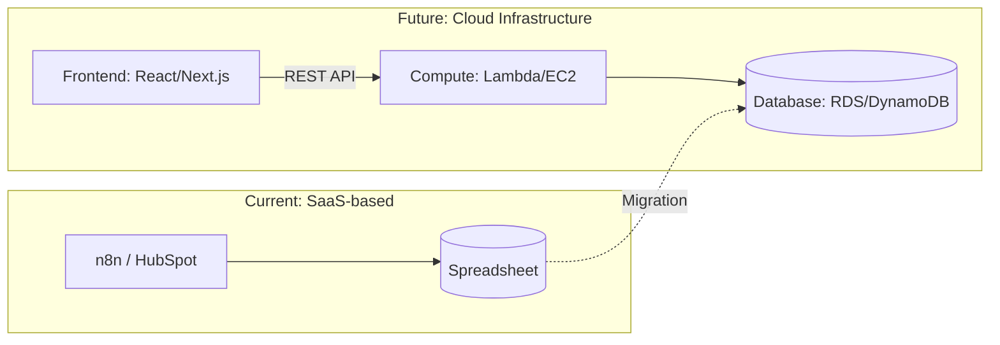
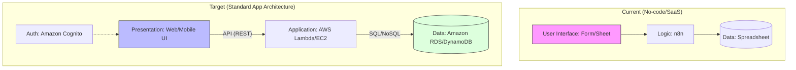
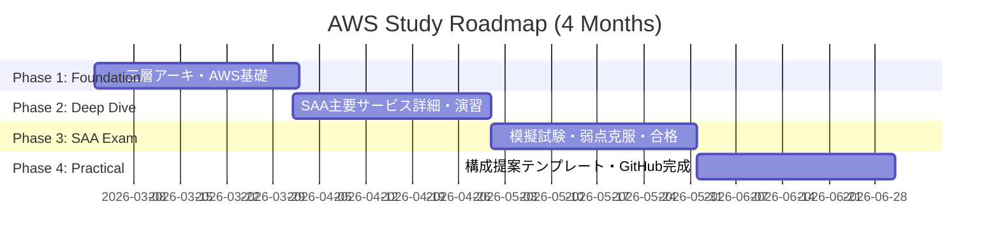

# Infrastructure Study Project (2026.03 - 2026.06)

本リポジトリは、SaaS（n8n/HubSpot）を活用したPM経験を持つ私が、
「インフラ構成をゼロから設計・提案できるITコンサル/PM」へ進化するための学習記録です。

## 1. なぜ「インフラ」を学ぶのか

### 現状の課題
* **抽象的な提案の限界:** n8nやスプレッドシートを用いた構築経験はあるが、大規模化・アプリ化の際の「インフラ構成」を具体化できていない。
* **技術選定の根拠不足:** DBの種類やサーバー構成の選択肢、それぞれのトレードオフを論理的に説明できない。

### 4ヶ月後の理想像
* **AWS SAA取得:** クラウドインフラの標準知識を体系的に習得している。
* **アーキテクチャ設計力:** 顧客の要件に対し、三層アーキテクチャに基づいた構成図（Mermaid等）を用いて一次回答ができる。

---

## 2. インフラ移行の概念イメージ

n8n+スプシの構成から、スケーラブルなWebアプリ構成への進化図です。

現状（n8n/スプシ）から、目指すべき標準的な構成への変化イメージです。

---

## 3. 3月第1週：スタートダッシュ計画

「インフラアレルギー」を無くし、全体像を掴むための1週間のスケジュールです。

### 使用教材

1. **Udemy:** [これだけでOK！ AWS 認定ソリューションアーキテクト – アソシエイト試験突破講座](https://www.google.com/search?q=https://www.udemy.com/share/101WM63%40O7j7_E7M_jO4Q7VfFpGv9-H1-t0j6YtF/)
2. **書籍:** 『図解即戦力 Amazon Web Servicesのしくみと技術がこれ1冊でしっかりわかる教科書』

### 日別スケジュール

| 日付 | 学習テーマ | 具体的なアクション | 清書ターゲット (GitHub/Notion) |
| --- | --- | --- | --- |
| **Day 1** | **全体俯瞰** | 書籍の第1章〜2章を読み、AWSで何ができるかを把握。 | AWSの主要サービス分類（計算、蓄積、網）の整理。 |
| **Day 2** | **箱を作る (VPC)** | UdemyのVPCセクションを視聴。ネットワークの「境界」を理解。 | VPC、サブネット、インターネットゲートウェイの図解。 |
| **Day 3** | **サーバーを立てる** | UdemyのEC2セクション。実際にインスタンスを1つ立ててみる。 | EC2の料金体系とインスタンスタイプの選び方。 |
| **Day 4** | **データを貯める** | UdemyのRDS/S3セクション。スプシとの違いを意識する。 | 構造化データ(RDS)と非構造化データ(S3)の使い分け。 |
| **Day 5** | **繋ぐ (API)** | API Gatewayの概要を調査。「n8nのWebhook」との対応を考える。 | WebリクエストがDBに届くまでのフロー図。 |
| **Day 6** | **振り返り・整理** | 今週学んだ用語を自分なりの言葉でGitHubにまとめる。 | 「スプシ脱却」の一次回答案（Ver.1）の作成。 |
| **Day 7** | **予備日/調整** | 遅れている箇所の補習、または42 Tokyoの課題。 | 次週の学習範囲の確定。 |

---

## 4. 学習の進捗管理 (Mermaid Gantt)

