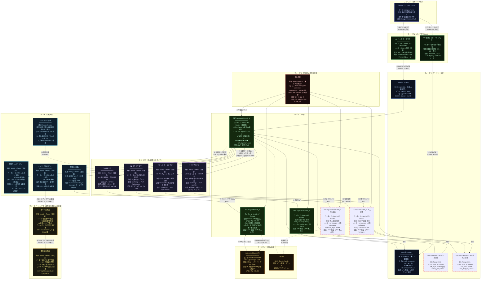

```mermaid
flowchart TB

    subgraph P0["フェーズ 0　目標データ投入"]
        SS["Google スプレッドシート\n────────────\nデータ: tgt / gpu / tv / tr\n役割: 期初の目標値マスター\n操作者: 管理者が手入力\n技術: Google Sheets API v4"]
    end

    subgraph P1["フェーズ 1　バッチ取込 (n8n)"]
        N8N_B["n8n バッチ ワークフロー\n────────────\nホスト: n8n Cloud または Self-hosted\nトリガー: Cron（期初・定期）\n役割: SS → DB 目標値 取込\n技術: Google Sheets ノード\n      + PostgreSQL ノード"]
        N8N_M["n8n 手動トリガー ワークフロー\n────────────\nトリガー: 管理者が手動実行\n役割: 確定月実績を SS → DB 上書き\n技術: Webhook ノード\n      + PostgreSQL UPDATE ノード"]
        SS -->|"① 期初バッチ実行\nSheetsAPI 読取"| N8N_B
        SS -->|"② 手動トリガー実行\nSheetsAPI 読取"| N8N_M
    end

    subgraph P2["フェーズ 2　データベース層"]
        MT["monthly_targets\n────────────\nDB: PostgreSQL（未定 ⚠️要確認）\nカラム: staff_id / month\n        tgt / gpu / tv★ / tr★\nINDEX: staff_id + month"]
        MA["monthly_actuals\n────────────\nDB: PostgreSQL（未定 ⚠️要確認）\nカラム: staff_id / month\n        act / ag / vis\n        enq★ / est★\n        st: done/active/future\n備考: LY（前年）も同テーブルで管理"]
        CAL["staff_calendars ⚠️テーブル未定義\n────────────\nDB: PostgreSQL\nカラム: staff_id / month\n        off_days: JSONB配列\n        working_days: INT"]
        SIM["staff_sim_settings ⚠️テーブル未定義\n────────────\nDB: PostgreSQL\nカラム: staff_id / month\n        sim_vals: JSONB\n        sim_start_day: DATE"]
        N8N_B -->|"③ INSERT/UPDATE\nmonthly_targets"| MT
        N8N_M -->|"④ UPDATE\nmonthly_actuals"| MA
    end

    subgraph P3["フェーズ 3　認証層 ⚠️設計未確定"]
        AUTH["認証基盤\n────────────\n技術: Supabase Auth（未定 ⚠️要確認）\nロール: staff / manager / area / exec\nJWT claims に role を付与\nRow Level Security でDB制御\n注意: ロールにより\n      参照できる画面・データが異なる"]
    end

    subgraph P4["フェーズ 4　API層"]
        API1["GET /api/monthly/:staff_id\n────────────\nランタイム: Next.js API Routes（要確認）\nホスト: Vercel（未定 ⚠️要確認）\nレスポンス: M配列 12ヶ月分\n           LY配列（前年実績）\n           + tv★/tr★/enq★/est★\n           + off_days / sim_vals\n認証: JWT 検証 / RLS"]
        API2["PUT /api/actuals/:staff_id\n────────────\nランタイム: Next.js API Routes\n役割: 実績5項目 保存\nBody: vis/enq/est/cl/ag\nトリガー: onchange → 即時PUT\n認証: JWT 検証（staff 本人のみ）"]
        API3["PUT /api/calendar/:staff_id ⚠️未定義\n────────────\nランタイム: Next.js API Routes\n役割: 休み設定 保存\nトリガー: onchange → 3秒 debounce\nBody: off_days JSONB\n認証: JWT 検証（staff 本人のみ）"]
        API4["PUT /api/sim/:staff_id ⚠️未定義\n────────────\nランタイム: Next.js API Routes\n役割: 努力KPI設定 保存\nトリガー: onchange → 3秒 debounce\nBody: simVals JSONB\n認証: JWT 検証（staff / manager）"]
        API_AI["POST /api/aifb/:staff_id\n────────────\nランタイム: Next.js API Routes\n役割: Claude API 呼び出し\nプロンプト: SPJ04\n入力: M配列 + 商談履歴\nレスポンス: 数値FB / BN診断 / 改善提案\n認証: JWT 検証（staff 本人のみ）"]
        MT --> API1
        MA --> API1
        CAL --> API1
        SIM --> API1
        AUTH -->|"JWT検証 / RLS"| API1
        AUTH --> API2
        AUTH --> API3
        AUTH --> API4
        AUTH --> API_AI
    end

    subgraph P4EXT["フェーズ 4　外部AI連携"]
        CLAUDE["Anthropic Claude API\n────────────\nモデル: claude-sonnet-4-6\nSDK: @anthropic-ai/sdk\n認証: APIキー（サーバーサイド管理）\n用途: 月次数値FB / BN診断 / 商談FB\nプロンプト: SPJ04"]
        SENTRY["Sentry\n────────────\nSDK: @sentry/nextjs\n役割: エラー監視・アラート\n通知先: Slack / メール"]
        API_AI -->|"⑤ Claude API 呼び出し\nHTTPS POST"| CLAUDE
        CLAUDE -->|"⑥ FBテキスト返却"| API_AI
        API4 -.->|"例外発生時\nエラー送信"| SENTRY
        API1 -.-> SENTRY
    end

    subgraph P5["フェーズ 5　個人画面（スタッフ）"]
        S_CAL["📅 カレンダーサブタブ\n────────────\n技術: Next.js + React（要確認）\nUI: 7×6グリッド カレンダー\n操作: タップで休み⇔出勤切替\n連動: recalcWD() 残り営業日再計算\n保存: onchange → PUT /api/calendar"]
        S_ACT["📊 今日サブタブ\n────────────\n技術: Next.js + React（要確認）\nUI: ファネル / BN診断 / 目標指標\n操作: 実績5項目 手入力\n保存: onchange → PUT /api/actuals\n計算: 全てクライアントサイドJS"]
        S_SIM["📐 SIMサブタブ\n────────────\n技術: Next.js + React（要確認）\nUI: SIMカレンダー + KPI入力\n操作: 転換率3値 / 台粗利 入力\n保存: onchange → PUT /api/sim\n計算: 着地SIM / 改善プラン（クライアントJS）"]
        S_AIFB["🤖 AI FBタブ\n────────────\n技術: Next.js + React（要確認）\nUI: 月次数値FB / 商談FB履歴\nプロンプト: SPJ04\n操作: 月送り（全12ヶ月）\nデータ取得: POST /api/aifb"]
        API1 -->|"⑦ 初期データ読込\nJSON レスポンス\n(M配列+LY配列+CAL+SIM)"| S_CAL
        API1 --> S_ACT
        API1 --> S_SIM
        API1 --> S_AIFB
        S_CAL -->|"⑧ 3秒 debounce\nPUT"| API3
        S_ACT -->|"⑨ 即時 PUT"| API2
        S_SIM -->|"⑩ 3秒 debounce\nPUT"| API4
        S_AIFB -->|"⑪ Claude API呼び出し\nPOST"| API_AI
        API2 -->|"保存"| MA
        API3 -->|"保存"| CAL
        API4 -->|"保存"| SIM
    end

    subgraph P6["フェーズ 6　店長画面"]
        M_CAL["店舗カレンダービュー\n────────────\n技術: Next.js + React（要確認）\nデータソース: API1レスポンス内\n              off_days を集約\n表示: 全メンバーの稼働日（色付き）\n同期: ページ読込時 ⚠️要確認\n      （リアルタイム化は別途検討）"]
        M_KPI["メンバー別KPIビュー\n────────────\n技術: Next.js + React（要確認）\nデータソース: API1レスポンス内\n              sim_vals を集約\n表示: 個人設定KPI・着地予想\n同期: ページ読込時 ⚠️要確認"]
        M_SIM["店舗 SIM連動\n────────────\n技術: Next.js + React（要確認）\n役割: 店長がメンバーKPIを調整\nデータ取得: API1\n保存: PUT /api/sim/:staff_id\n      （manager ロールで代理保存）"]
        M_DD["ドリルダウン閲覧\n────────────\n技術: Next.js Router\n操作: 店長が個人画面を閲覧専用で表示\n認証: role=manager のみ許可\nUI: 個人画面と同一コンポーネント\n    入力欄は read-only で描画"]
        API1 -->|"⑫ 初期データ読込\n全メンバー分を集約"| M_CAL
        API1 --> M_KPI
        API1 --> M_SIM
        M_SIM -->|"⑬ 代理保存\nPUT /api/sim"| API4
        API4 --> SIM
        M_DD -.->|"⑭ 閲覧専用\nread-only"| S_ACT
    end

    subgraph P7["フェーズ 7　エリア長・事業部長画面 ⚠️未実装"]
        A_VIEW["エリア長画面\n────────────\n技術: Next.js + React（未実装）\nデータ: 各店長KPI集計\n        + 店舗別着地予想\n⚠️店長→エリア長の\n  ロールアップAPI設計未定義\n  GET /api/area/:area_id 相当が必要"]
        E_VIEW["事業部長画面\n────────────\n技術: Next.js + React（未実装）\nデータ: 各エリア長KPI集計\n        + エリア別着地予想\n⚠️エリア長→事業部長の\n  ロールアップAPI設計未定義\n  GET /api/division/:div_id 相当が必要"]
        M_KPI -->|"⚠️ロールアップAPI未定義\n同期タイミング未確定"| A_VIEW
        A_VIEW -->|"⚠️ロールアップAPI未定義\n同期タイミング未確定"| E_VIEW
    end

    classDef p0  fill:#0f172a,stroke:#6366f1,color:#c7d2fe
    classDef p1  fill:#0c1a0c,stroke:#16a34a,color:#bbf7d0
    classDef p2  fill:#0c1220,stroke:#2563eb,color:#bfdbfe
    classDef p3  fill:#1a0c0c,stroke:#dc2626,color:#fecaca
    classDef p4  fill:#14290e,stroke:#15803d,color:#bbf7d0
    classDef ext fill:#1a1208,stroke:#d97706,color:#fde68a
    classDef p5  fill:#1a1a2e,stroke:#7c3aed,color:#ddd6fe
    classDef p6  fill:#0f1f2e,stroke:#0ea5e9,color:#bae6fd
    classDef p7  fill:#1a1a10,stroke:#ca8a04,color:#fef08a
    classDef warn stroke:#ef4444,stroke-width:2px,stroke-dasharray:4 3

    class SS p0
    class N8N_B,N8N_M p1
    class MT,MA p2
    class CAL,SIM warn
    class AUTH p3
    class API1,API2,API_AI p4
    class API3,API4 warn
    class CLAUDE,SENTRY ext
    class S_CAL,S_ACT,S_SIM,S_AIFB p5
    class M_CAL,M_KPI,M_SIM,M_DD p6
    class A_VIEW,E_VIEW p7
```
