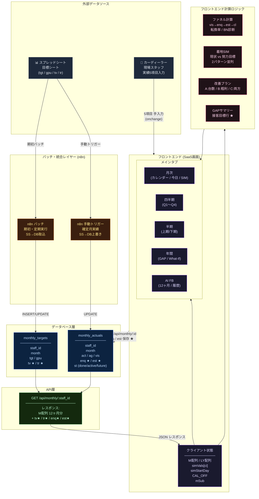

```mermaid

flowchart TB
    subgraph EXT["外部データソース"]
        SS["📊 スプレッドシート\n目標シート\n(tgt / gpu / tv / tr)"]
        CS["👤 カーディーラー\n現場スタッフ\n実績5項目入力"]
    end

    subgraph ETL["バッチ・統合レイヤー (n8n)"]
        N8N_B["n8n バッチ\n期初・定期実行\nSS→DB取込"]
        N8N_M["n8n 手動トリガー\n確定月実績\nSS→DB上書き"]
    end

    subgraph DB["データベース層"]
        MT["monthly_targets\n─────────────\nstaff_id\nmonth\ntgt / gpu\ntv ★ / tr ★"]
        MA["monthly_actuals\n─────────────\nstaff_id\nmonth\nact / ag / vis\nenq ★ / est ★\nst (done/active/future)"]
    end

    subgraph API["API層"]
        API1["GET /api/monthly/:staff_id\n─────────────────────\nレスポンス:\nM配列 12ヶ月分\n+ tv★ / tr★ / enq★ / est★"]
    end

    subgraph FE["フロントエンド (SaaS画面)"]
        direction TB
        subgraph TABS["メインタブ"]
            T1["月次\n(カレンダー / 今日 / SIM)"]
            T2["四半期\n(Q1〜Q4)"]
            T3["半期\n(上期/下期)"]
            T4["年間\n(GAP / What-If)"]
            T5["AI FB\n(12ヶ月 / 履歴)"]
        end
        STATE["クライアント状態\n─────────────\nM配列 / LY配列\nsimVals[ci]\nsimStartDay\nCAL_OFF\nmSub"]
    end

    subgraph LOGIC["フロントエンド計算ロジック"]
        L1["ファネル計算\nvis→enq→est→cl\n転換率 / BN診断"]
        L2["着地SIM\n現状 vs 努力目標\n2パターン並列"]
        L3["改善プラン\nA:台数 / B:粗利 / C:両方"]
        L4["GAPサマリー\n接客目標行 ★"]
    end

    SS -->|"期初バッチ"| N8N_B
    SS -->|"手動トリガー"| N8N_M
    N8N_B -->|"INSERT/UPDATE"| MT
    N8N_M -->|"UPDATE"| MA

    MT --> API1
    MA --> API1
    API1 -->|"JSON レスポンス"| STATE

    CS -->|"5項目 手入力\n(onchange)"| FE
    FE -->|"PUT /api/monthly/:id\nenq / est 保存 ★"| MA

    STATE --> TABS
    STATE --> LOGIC
    LOGIC --> TABS

    classDef extBox fill:#1e293b,stroke:#475569,color:#e2e8f0
    classDef etlBox fill:#3b1f0f,stroke:#b45309,color:#fde68a
    classDef dbBox fill:#0c2340,stroke:#1d4ed8,color:#bfdbfe
    classDef apiBox fill:#14290e,stroke:#15803d,color:#bbf7d0
    classDef feBox fill:#1a1a2e,stroke:#7c3aed,color:#ddd6fe
    classDef logicBox fill:#1f1217,stroke:#be185d,color:#fbcfe8
    classDef newBadge fill:#7c3aed,stroke:#7c3aed,color:#fff

    class SS,CS extBox
    class N8N_B,N8N_M etlBox
    class MT,MA dbBox
    class API1 apiBox
    class T1,T2,T3,T4,T5,STATE feBox
    class L1,L2,L3,L4 logicBox

```
