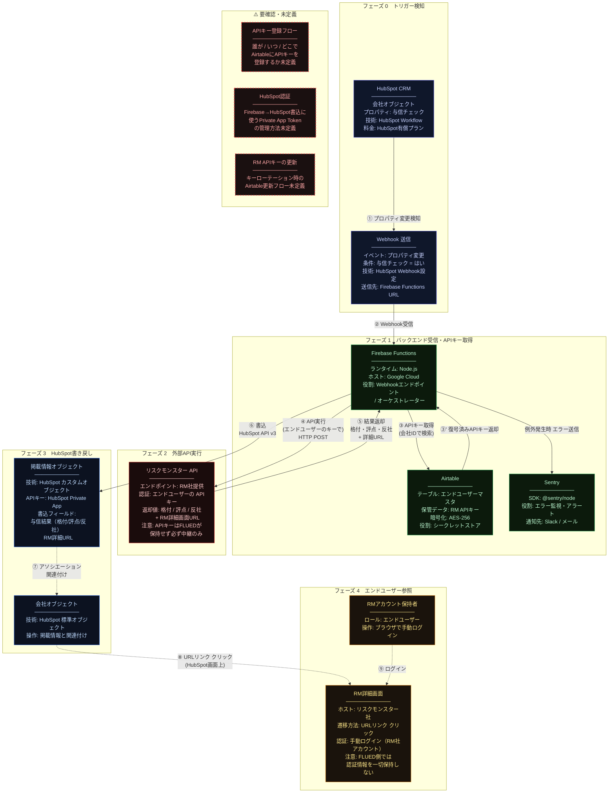

```mermaid

flowchart TB

    subgraph P0["フェーズ 0　トリガー検知"]
        direction LR
        HS_CRM["HubSpot CRM\n────────────\n会社オブジェクト\nプロパティ: 与信チェック\n技術: HubSpot Workflow\n料金: HubSpot有償プラン"]
        HS_WH["Webhook 送信\n────────────\nイベント: プロパティ変更\n条件: 与信チェック = はい\n技術: HubSpot Webhook設定\n送信先: Firebase Functions URL"]
        HS_CRM -->|"① プロパティ変更検知"| HS_WH
    end

    subgraph P1["フェーズ 1　バックエンド受信・APIキー取得"]
        direction LR
        FB_FUNC["Firebase Functions\n────────────\nランタイム: Node.js\nホスト: Google Cloud\n役割: Webhookエンドポイント\n        / オーケストレーター"]
        AT["Airtable\n────────────\nテーブル: エンドユーザーマスタ\n保管データ: RM APIキー\n暗号化: AES-256\n役割: シークレットストア"]
        SENTRY["Sentry\n────────────\nSDK: @sentry/node\n役割: エラー監視・アラート\n通知先: Slack / メール"]
        HS_WH -->|"② Webhook受信"| FB_FUNC
        FB_FUNC -->|"③ APIキー取得\n(会社IDで検索)"| AT
        AT -->|"③' 復号済みAPIキー返却"| FB_FUNC
        FB_FUNC -->|"例外発生時 エラー送信"| SENTRY
    end

    subgraph P2["フェーズ 2　外部API実行"]
        direction LR
        RM_API["リスクモンスター API\n────────────\nエンドポイント: RM社提供\n認証: エンドユーザーの APIキー\n返却値: 格付 / 評点 / 反社\n        + RM詳細画面URL\n注意: APIキーはFLUEDが\n      保持せず必ず中継のみ"]
        FB_FUNC -->|"④ API実行\n(エンドユーザーのキーで)\nHTTP POST"| RM_API
        RM_API -->|"⑤ 結果返却\n格付・評点・反社\n+ 詳細URL"| FB_FUNC
    end

    subgraph P3["フェーズ 3　HubSpot書き戻し"]
        direction LR
        HS_OBJ["掲載情報オブジェクト\n────────────\n技術: HubSpot カスタムオブジェクト\nAPIキー: HubSpot Private App\n書込フィールド:\n  与信結果（格付/評点/反社）\n  RM詳細URL"]
        HS_REL["会社オブジェクト\n────────────\n技術: HubSpot 標準オブジェクト\n操作: 掲載情報と関連付け"]
        FB_FUNC -->|"⑥ 書込\nHubSpot API v3"| HS_OBJ
        HS_OBJ -.->|"⑦ アソシエーション\n関連付け"| HS_REL
    end

    subgraph P4["フェーズ 4　エンドユーザー参照"]
        direction LR
        RM_DETAIL["RM詳細画面\n────────────\nホスト: リスクモンスター社\n遷移方法: URLリンク クリック\n認証: 手動ログイン（RM社アカウント）\n注意: FLUED側では\n      認証情報を一切保持しない"]
        HS_REL -.->|"⑧ URLリンク クリック\n(HubSpot画面上)"| RM_DETAIL
        RM_USER["RMアカウント保持者\n────────────\nロール: エンドユーザー\n操作: ブラウザで手動ログイン"]
        RM_USER -.->|"⑨ ログイン"| RM_DETAIL
    end

    subgraph UNKNOWN["⚠️ 要確認・未定義"]
        UNK1["APIキー登録フロー\n────────────\n誰が / いつ / どこで\nAirtableにAPIキーを\n登録するか未定義"]
        UNK2["HubSpot認証\n────────────\nFirebase→HubSpot書込に\n使うPrivate App Token\nの管理方法未定義"]
        UNK3["RM APIキーの更新\n────────────\nキーローテーション時の\nAirtable更新フロー未定義"]
    end

    classDef p0 fill:#0f172a,stroke:#6366f1,color:#c7d2fe
    classDef p1 fill:#0c1a0c,stroke:#16a34a,color:#bbf7d0
    classDef p2 fill:#1a0c0c,stroke:#dc2626,color:#fecaca
    classDef p3 fill:#0c1220,stroke:#2563eb,color:#bfdbfe
    classDef p4 fill:#1a130c,stroke:#d97706,color:#fde68a
    classDef unk fill:#1a1010,stroke:#ef4444,stroke-width:2px,color:#fca5a5,stroke-dasharray:4 4

    class HS_CRM,HS_WH p0
    class FB_FUNC,AT,SENTRY p1
    class RM_API p2
    class HS_OBJ,HS_REL p3
    class RM_DETAIL,RM_USER p4
    class UNK1,UNK2,UNK3 unk

```
