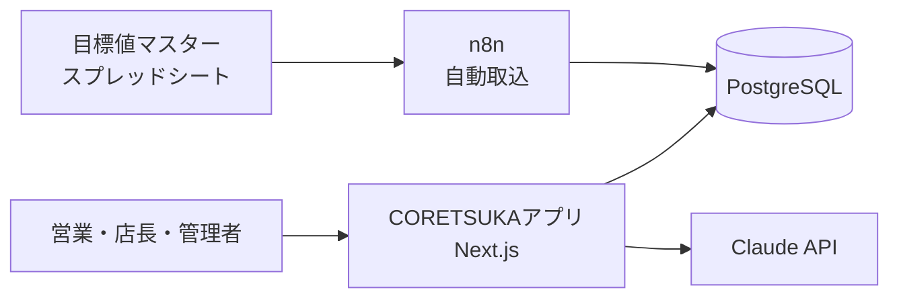
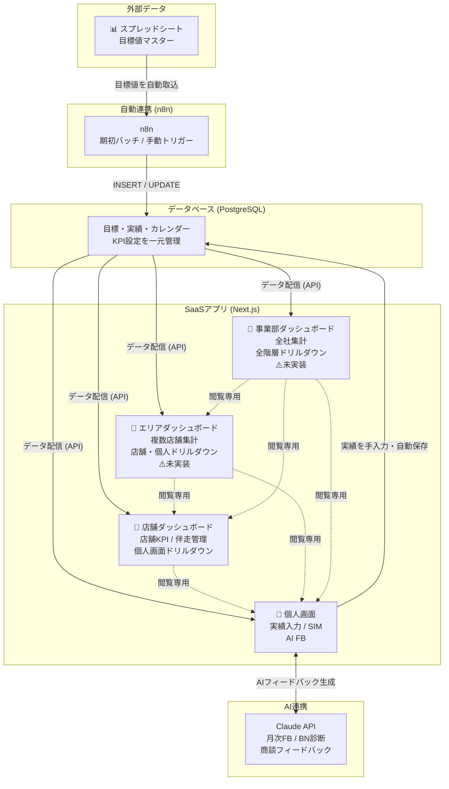

# CORETSUKA — システム概要

> プロダクト: AI搭載カーディーラー営業支援SaaS
> バージョン: V2.0
> 作成日: 2026/03/26
> 作成者: Claude (based on 設計書 V2.0 / プロトタイプHTML / 議事録)

---

## 0. システム全体像（超シンプル版）

### 一言でいうと

* **目標値**はスプレッドシートで管理し、**n8n**でDBへ自動取込します。
* **日々の実績入力・閲覧**は、ユーザーが **CORETSUKAアプリ** から行います。
* アプリは **PostgreSQL** のデータを読み書きし、必要に応じて **Claude API** を呼び出してAIフィードバックを返します。

---

## 0.5 システム全体像（シンプル版）

---

## 1. プロダクト基本情報

| 項目      | 内容                                                  |
| ------- | --------------------------------------------------- |
| プロダクト名  | CORETSUKA                                           |
| 運営会社    | 株式会社T3（WKUホールディングスグループ）                             |
| 対象業種    | カーディーラー（新車・中古車販売）                                   |
| ブランドカラー | Navy `#0A0E1A` / Orange `#E8541E` / Cyan `#00D4FF`  |
| フォント    | Noto Sans JP / Zen Kaku Gothic New / JetBrains Mono |
| レスポンシブ  | max-width: 920px / モバイル対応（600px以下でグリッド1列化）          |

---

## 2. ロール構成と閲覧権限

| ロール        | 識別子       | 自画面              | ドリルダウン先                      |
| ---------- | --------- | ---------------- | ---------------------------- |
| 営業個人（スタッフ） | `staff`   | 個人ダッシュボード        | —                            |
| 店長         | `manager` | 店舗ダッシュボード        | 配下スタッフの個人画面（閲覧専用）            |
| エリア長       | `area`    | エリアダッシュボード ⚠️未実装 | 配下店舗ダッシュボード + スタッフ個人画面（閲覧専用） |
| 事業部長       | `exec`    | 事業部ダッシュボード ⚠️未実装 | 配下エリア・店舗・スタッフ全画面（閲覧専用）       |

---

## 3. 画面一覧

### 画面 1｜個人ダッシュボード（staff）

**URL想定:** `/staff/:staff_id`
**実装状態:** ✅ プロトタイプ完成（`coretsuka_staff_screens.html`）

| タブ    | サブタブ         | 主要コンテンツ                                                                 |
| ----- | ------------ | ----------------------------------------------------------------------- |
| 月次    | 📅 カレンダー     | 稼働カレンダー（休み⇔出勤切替 / 過去日修正可）/ 残り営業日サマリー                                    |
| 月次    | 📊 今日（デフォルト） | 実績ファネル / BN診断 / 目標指標カード(tv/tr) / 実績5項目入力 / 成約率バー / 昨年対比                 |
| 月次    | 📐 SIM       | SIMカレンダー / 来場予測入力 / 努力KPI入力 / 着地SIM 2パターン並列 / 粗利SIM / 改善プラン3種 / 全国平均比較表 |
| 四半期   | —            | KPIカード4指標 / 目標指標カード / 月別内訳テーブル12列 / ファネル比較 / 昨年対比                       |
| 半期    | —            | KPIカード / 目標指標カード / 月別推移テーブル12列 / 上下半期比較 / 昨年対比                          |
| 年間    | —            | GAPサマリーテーブル9行 / 季節指数カレンダー / What-If SIM                                 |
| AI FB | —            | 月次数値FB（SPJ04）/ 商談FBスコア履歴（SPJ03）/ 約束・面談メモ                                |

### 画面 2｜店舗ダッシュボード（manager）

**URL想定:** `/store/:store_id`
**実装状態:** ✅ プロトタイプ完成（`coretsuka_manager_mockup.html`）

| タブ     | 主要コンテンツ                                                                                                                           |
| ------ | --------------------------------------------------------------------------------------------------------------------------------- |
| 月次     | 店舗KPIカード（累積来場/成約/粗利/残り必要台数）/ 未入力アラート・リマインド / 店舗カレンダービュー（全メンバー稼働日）/ 目標配分SIM 3モード（①自動按分 ②手動編集 ③メンバー目標）/ メンバー別KPI・着地予想 / 伴走マネジメントフロー |
| 四半期    | 店舗KPI / Q着地予想（SIM連動）/ メンバー別四半期実績テーブル / 月別内訳                                                                                       |
| 半期     | 店舗KPI / 月別推移テーブル / 上下半期比較                                                                                                         |
| 年間     | 年間サマリーKPI / 12ヶ月チャート / メンバー別年間累計テーブル / 季節指数修正目標 / What-If SIM                                                                     |
| 入力状況   | メンバー別入力状況（済/未）/ 最終更新時刻 / 月間入力履歴カレンダー                                                                                              |
| 個人比較   | ファネル比較テーブル（全メンバー横並び）/ 成約率トレンドグラフ / 個別アクション推奨                                                                                      |
| ドリルダウン | 任意スタッフの個人画面を閲覧専用表示（「店長閲覧中」バッジ / 入力欄 read-only）                                                                                    |

### 画面 3｜エリアダッシュボード（area）

**URL想定:** `/area/:area_id`
**実装状態:** ⚠️ フェーズ2で開発予定
**設計方針:** 店舗ダッシュボードの上位集計版。配下の複数店舗データをロールアップして表示。

| タブ     | 主要コンテンツ                                                      |
| ------ | ------------------------------------------------------------ |
| 月次     | エリアKPIカード（配下全店舗合計）/ 店舗別KPI一覧（達成率色分け）/ 未入力店舗アラート / 店舗別目標配分SIM |
| 四半期    | エリアKPI / 店舗別四半期実績テーブル / Q着地予想                                |
| 半期     | エリアKPI / 月別推移テーブル / 上下半期比較                                   |
| 年間     | 年間エリアサマリー / 店舗別年間累計テーブル / 残り必要台数                             |
| 店舗比較   | 店舗別ファネル比較テーブル / 成約率トレンド / 店舗別アクション推奨                         |
| ドリルダウン | 任意店舗の店舗ダッシュボード → さらにスタッフ個人画面まで閲覧専用                           |

### 画面 4｜事業部ダッシュボード（exec）

**URL想定:** `/division/:division_id`
**実装状態:** ⚠️ フェーズ3で開発予定
**設計方針:** エリアダッシュボードの上位集計版。全エリアデータをロールアップして表示。

| タブ     | 主要コンテンツ                                         |
| ------ | ----------------------------------------------- |
| 月次     | 事業部KPIカード（全エリア合計）/ エリア別KPI一覧（達成率色分け）/ 未達エリアアラート |
| 四半期    | 事業部KPI / エリア別四半期実績テーブル / Q着地予想                  |
| 半期     | 事業部KPI / 月別推移テーブル / 上下半期比較                      |
| 年間     | 年間事業部サマリー / エリア別年間累計テーブル / 残り必要台数               |
| エリア比較  | エリア別ファネル比較テーブル / 成約率トレンド / エリア別アクション推奨          |
| ドリルダウン | 任意エリア → 店舗ダッシュボード → スタッフ個人画面まで閲覧専用              |

---

## 4. 機能一覧

### 4.1 個人ダッシュボード機能

| #  | 機能名              | タブ/サブタブ | 概要                                           | V2           |
| -- | ---------------- | ------- | -------------------------------------------- | ------------ |
| 1  | 月次ヘッダー           | 月次・全共通  | 今日の日付 / 月送り / 台数・粗利進捗バー / ステータスバッジ           | —            |
| 2  | 稼働カレンダー          | 月次 📅   | 7×6グリッド / タップで休み⇔出勤切替（過去日修正可）/ デフォルト休日: 毎週水曜 | ✅ 過去日修正可     |
| 3  | 残り営業日サマリー        | 月次 📅   | 残り平日数・土日祝数の表示                                | —            |
| 4  | 実績ファネル           | 月次 📊   | 来場→アンケート→見積→成約 / 転換率を🟢🟡🔴色分け               | —            |
| 5  | ボトルネック診断         | 月次 📊   | 機会損失最大ステップ自動検出 / 「+X台・+Y万/月」表示 / 推奨ロープレ3種    | —            |
| 6  | 目標指標カード          | 月次 📊   | SSから取得した接客目標(tv)・成約率目標(tr) / 実績差分を色分け        | ✅ V2新規       |
| 7  | 実績5項目入力          | 月次 📊   | 来場/アンケート/見積/成約/台粗利をonchangeで入力・自動保存          | ✅ 3→5項目      |
| 8  | 成約率バー            | 月次 📊   | 実績成約率 vs 全国平均53.2%                           | —            |
| 9  | 昨年対比             | 月次 📊   | 前年同月との台数・粗利差分                                | —            |
| 10 | SIMカレンダー（開始日選択）  | 月次 📐   | 任意日から残り営業日を再計算                               | ✅ V2新規       |
| 11 | 来場予測入力           | 月次 📐   | 平日/日・土日祝/日の来場予測組数                            | —            |
| 12 | 努力KPI入力          | 月次 📐   | 転換率3値・台粗利を数値入力 / 3秒debounce自動保存              | ✅ スライダー→数値入力 |
| 13 | 着地SIM 2パターン並列    | 月次 📐   | 「現状のまま」vs「努力目標」の台数・粗利着地を並列表示                 | ✅ V2新規       |
| 14 | 粗利SIM            | 月次 📐   | 台数に加え粗利も同時シミュレーション                           | ✅ V2新規       |
| 15 | 改善プラン自動表示        | 月次 📐   | 目標未達時にプランA(台数)/B(粗利)/C(両方)を自動算出              | ✅ V2新規       |
| 16 | 全国平均比較表          | 月次 📐   | 転換率テーブル（全国平均 vs 努力目標）+ 着地台数比較カード             | ✅ V2新規       |
| 17 | 四半期KPIカード        | 四半期     | 台数・粗利・成約率・台粗利の4KPI                           | —            |
| 18 | 目標指標カード（四半期）     | 四半期     | 四半期内のtv/tr集計 / 実績差分表示                        | ✅ V2新規       |
| 19 | 月別内訳テーブル12列      | 四半期・半期  | 台数差・台粗利差・粗利差・成約率差・vs全国を追加                    | ✅ 7→12列      |
| 20 | 目標指標カード（半期）      | 半期      | 半期内のtv/tr集計 / 実績差分表示                         | ✅ V2新規       |
| 21 | GAPサマリーテーブル      | 年間      | 9行（残粗利・要成約台数・成約率・要接客数/月 等）                   | ✅ 接客目標行追加    |
| 22 | 季節指数カレンダー        | 年間      | 残り要成約台数を季節指数で月別再配分 / 台粗利根拠明記                 | ✅ 説明文更新      |
| 23 | What-If SIM（年間）  | 年間      | KPIスライダーで年間着地を試算                             | —            |
| 24 | AI月次数値FB（SPJ04）  | AI FB   | Claude APIによる称賛/総括/BN診断/GAP/改善アクション          | —            |
| 25 | 商談FBスコア履歴（SPJ03） | AI FB   | 商談ごとのAIスコアと改善コメント一覧（月送り12ヶ月）                 | —            |
| 26 | 約束・面談メモ          | AI FB   | 面談内容・今月の約束事項を入力保存 / 店長に自動連携                  | —            |

### 4.2 店舗ダッシュボード機能

| #  | 機能名           | タブ   | 概要                                              |
| -- | ------------- | ---- | ----------------------------------------------- |
| 27 | 店舗KPIカード      | 月次   | 累積来場/成約/粗利/残り必要台数（/日換算）                         |
| 28 | 未入力アラート       | 月次   | 未入力メンバーをアラート表示・タップでリマインド送信                      |
| 29 | 店舗カレンダービュー    | 月次   | 全メンバーの稼働日を色付きで可視化（個人カレンダーから自動反映）                |
| 30 | 目標配分SIM 3モード  | 月次   | ①自動按分（個人転換率で計算）②手動編集 ③メンバー自身の目標表示               |
| 31 | メンバー別KPI・着地予想 | 月次   | 個人設定の努力KPI・着地予想を一覧表示（店長が調整可）                    |
| 32 | 伴走マネジメントフロー   | 月次   | メンバーごとに面談ステータス/約束確認/次アクション管理                    |
| 33 | Q着地予想（SIM連動）  | 四半期  | 個人SIM値を集計した四半期着地予想                              |
| 34 | 店舗四半期KPI      | 四半期  | 累積台数・粗利・成約率・台粗利                                 |
| 35 | 店舗半期推移        | 半期   | 月別推移テーブル / 上下半期比較                               |
| 36 | 店舗年間サマリー      | 年間   | 12ヶ月チャート / メンバー別年間累計テーブル / 季節指数目標 / What-If SIM |
| 37 | 入力状況モニター      | 入力状況 | メンバー別日次入力状況・最終更新時刻・月間入力履歴                       |
| 38 | メンバー個人比較      | 個人比較 | ファネル比較テーブル / 成約率トレンドグラフ / 個別アクション推奨             |
| 39 | ドリルダウン（個人画面）  | 全タブ  | 任意スタッフの個人画面を閲覧専用で表示（「店長閲覧中」バッジ）                 |

### 4.3 エリアダッシュボード機能 ⚠️未実装

| #  | 機能名           | タブ   | 概要                               |
| -- | ------------- | ---- | -------------------------------- |
| 40 | エリアKPIカード     | 月次   | 配下全店舗の累積来場/成約/粗利/残り必要台数          |
| 41 | 店舗別KPI一覧      | 月次   | 各店舗の達成率・残り必要台数を色分け一覧             |
| 42 | 未入力店舗アラート     | 月次   | 入力遅延店舗の検出・リマインド                  |
| 43 | 店舗別目標配分SIM    | 月次   | 各店舗への台数・粗利配分試算                   |
| 44 | エリア四半期KPI     | 四半期  | 累積台数・粗利・成約率・台粗利                  |
| 45 | 店舗別四半期実績テーブル  | 四半期  | 各店舗の四半期実績横並び比較                   |
| 46 | エリア半期KPI      | 半期   | 上下半期比較                           |
| 47 | エリア年間サマリー     | 年間   | 店舗別年間累計テーブル / 残り必要台数             |
| 48 | 店舗比較（ファネル）    | 店舗比較 | 店舗別ファネル比較 / 成約率トレンド / 店舗別アクション推奨 |
| 49 | ドリルダウン（店舗→個人） | 全タブ  | 任意店舗の店舗ダッシュボード → スタッフ個人画面まで閲覧専用  |

### 4.4 事業部ダッシュボード機能 ⚠️未実装

| #  | 機能名               | タブ    | 概要                          |
| -- | ----------------- | ----- | --------------------------- |
| 50 | 事業部KPIカード         | 月次    | 全エリア合計の累積来場/成約/粗利/残り必要台数    |
| 51 | エリア別KPI一覧         | 月次    | 各エリアの達成率・残り必要台数を色分け一覧       |
| 52 | 未達エリアアラート         | 月次    | 達成率低下エリアの自動検出               |
| 53 | 事業部四半期KPI         | 四半期   | エリア別四半期実績テーブル               |
| 54 | 事業部半期KPI          | 半期    | エリア別上下半期比較                  |
| 55 | 事業部年間サマリー         | 年間    | エリア別年間累計テーブル / 残り必要台数       |
| 56 | エリア比較（ファネル）       | エリア比較 | エリア別ファネル比較 / 成約率トレンド        |
| 57 | ドリルダウン（エリア→店舗→個人） | 全タブ   | 任意エリア → 店舗 → スタッフ個人画面まで閲覧専用 |

### 4.5 共通・基盤機能

| #  | 機能名            | 概要                                          |
| -- | -------------- | ------------------------------------------- |
| 58 | 認証・ロール制御       | Supabase Auth（未確定）/ JWT / RLS によるロール別アクセス制御 |
| 59 | 自動保存（debounce） | カレンダー・KPI入力を3秒debounceでサーバーに自動保存            |
| 60 | n8n バッチ取込      | 期初に目標値（tgt/gpu/tv/tr）をSSからDBへ自動取込           |
| 61 | n8n 手動トリガー     | 確定月の実績値をSSからDBへ上書き                          |
| 62 | エラー監視（Sentry）  | サーバーサイドのエラーをSentryで捕捉・Slack通知               |

---

## 5. システムアーキテクチャ

```mermaid
flowchart TB

    subgraph P0["フェーズ 0　目標データ投入"]
        SS["Google スプレッドシート
────────────
データ: tgt / gpu / tv / tr
役割: 期初の目標値マスター
操作者: 管理者が手入力
技術: Google Sheets API v4"]
    end

    subgraph P1["フェーズ 1　バッチ取込 (n8n)"]
        N8N_B["n8n バッチ ワークフロー
────────────
ホスト: n8n Cloud または Self-hosted
トリガー: Cron（期初・定期）
役割: SS → DB 目標値 取込
技術: Google Sheets ノード
      + PostgreSQL ノード"]
        N8N_M["n8n 手動トリガー ワークフロー
────────────
トリガー: 管理者が手動実行
役割: 確定月実績を SS → DB 上書き
技術: Webhook ノード
      + PostgreSQL UPDATE ノード"]
        SS -->|"① 期初バッチ実行"| N8N_B
        SS -->|"② 手動トリガー実行"| N8N_M
    end

    subgraph P2["フェーズ 2　データベース層"]
        MT["monthly_targets
────────────
DB: PostgreSQL（未定 ⚠️要確認）
カラム: staff_id / month
        tgt / gpu / tv★ / tr★
INDEX: staff_id + month"]
        MA["monthly_actuals
────────────
DB: PostgreSQL（未定 ⚠️要確認）
カラム: staff_id / month
        act / ag / vis / enq★ / est★
        st: done/active/future
備考: LY（前年）も同テーブルで管理"]
        CAL["staff_calendars ⚠️テーブル未定義
────────────
DB: PostgreSQL
カラム: staff_id / month
        off_days: JSONB配列
        working_days: INT"]
        SIM["staff_sim_settings ⚠️テーブル未定義
────────────
DB: PostgreSQL
カラム: staff_id / month
        sim_vals: JSONB
        sim_start_day: DATE"]
        N8N_B -->|"③ INSERT/UPDATE monthly_targets"| MT
        N8N_M -->|"④ UPDATE monthly_actuals"| MA
    end

    subgraph P3["フェーズ 3　認証層 ⚠️設計未確定"]
        AUTH["認証基盤
────────────
技術: Supabase Auth（未定 ⚠️要確認）
ロール: staff / manager / area / exec
JWT claims に role を付与
Row Level Security でDB制御
注意: ロールにより参照できる
      画面・データが異なる"]
    end

    subgraph P4["フェーズ 4　API層"]
        API1["GET /api/monthly/:staff_id
────────────
ランタイム: Next.js API Routes（要確認）
ホスト: Vercel（未定 ⚠️要確認）
レスポンス: M配列 12ヶ月分 + LY配列
           tv★/tr★/enq★/est★
           + off_days / sim_vals
認証: JWT / RLS"]
        API2["PUT /api/actuals/:staff_id
────────────
役割: 実績5項目 保存
Body: vis/enq/est/cl/ag
トリガー: onchange → 即時PUT
認証: staff 本人のみ"]
        API3["PUT /api/calendar/:staff_id ⚠️未定義
────────────
役割: 休み設定 保存
トリガー: onchange → 3秒 debounce
Body: off_days JSONB
認証: staff 本人のみ"]
        API4["PUT /api/sim/:staff_id ⚠️未定義
────────────
役割: 努力KPI設定 保存
トリガー: onchange → 3秒 debounce
Body: simVals JSONB
認証: staff / manager"]
        API_AI["POST /api/aifb/:staff_id
────────────
役割: Claude API 呼び出し
プロンプト: SPJ04
入力: M配列 + 商談履歴
認証: staff 本人のみ"]
        API_STORE["GET /api/store/:store_id ⚠️未定義
────────────
役割: 配下全スタッフの
      actuals / CAL / SIM を集約して返却
認証: manager / area / exec"]
        API_AREA["GET /api/area/:area_id ⚠️未実装
────────────
役割: 配下全店舗データを
      店舗単位でロールアップ集計
認証: area / exec"]
        API_DIV["GET /api/division/:div_id ⚠️未実装
────────────
役割: 配下全エリアデータを
      エリア単位でロールアップ集計
認証: exec のみ"]
        MT --> API1
        MA --> API1
        CAL --> API1
        SIM --> API1
        MA --> API_STORE
        CAL --> API_STORE
        SIM --> API_STORE
        MA --> API_AREA
        MA --> API_DIV
        AUTH -->|"JWT検証 / RLS"| API1
        AUTH --> API2
        AUTH --> API3
        AUTH --> API4
        AUTH --> API_AI
        AUTH --> API_STORE
        AUTH --> API_AREA
        AUTH --> API_DIV
    end

    subgraph P4EXT["フェーズ 4　外部AI・監視連携"]
        CLAUDE["Anthropic Claude API
────────────
モデル: claude-sonnet-4-6
SDK: @anthropic-ai/sdk
認証: APIキー（サーバーサイド管理）
用途: 月次数値FB / BN診断 / 商談FB
プロンプト: SPJ04"]
        SENTRY["Sentry
────────────
SDK: @sentry/nextjs
役割: エラー監視・アラート
通知先: Slack / メール"]
        API_AI -->|"⑤ HTTPS POST"| CLAUDE
        CLAUDE -->|"⑥ FBテキスト返却"| API_AI
        API1 -.->|"例外時"| SENTRY
        API4 -.-> SENTRY
    end

    subgraph P5["フェーズ 5　個人画面（staff）✅実装済"]
        S_CAL["📅 カレンダーサブタブ
────────────
技術: Next.js + React（要確認）
UI: 7×6グリッド カレンダー
操作: タップで休み⇔出勤切替
連動: recalcWD() 残り営業日再計算
保存: onchange → PUT /api/calendar"]
        S_ACT["📊 今日サブタブ
────────────
技術: Next.js + React（要確認）
UI: ファネル / BN診断 / 目標指標
操作: 実績5項目 手入力
保存: onchange → PUT /api/actuals
計算: クライアントサイドJS"]
        S_SIM["📐 SIMサブタブ
────────────
技術: Next.js + React（要確認）
UI: SIMカレンダー + KPI入力
操作: 転換率3値 / 台粗利 入力
保存: onchange → PUT /api/sim
計算: 着地SIM / 改善プラン（クライアントJS）"]
        S_AIFB["🤖 AI FBタブ
────────────
技術: Next.js + React（要確認）
UI: 月次数値FB / 商談FB履歴
プロンプト: SPJ04
操作: 月送り（全12ヶ月）
データ取得: POST /api/aifb"]
        API1 -->|"⑦ 初期データ読込"| S_CAL
        API1 --> S_ACT
        API1 --> S_SIM
        API1 --> S_AIFB
        S_CAL -->|"⑧ 3秒 debounce PUT"| API3
        S_ACT -->|"⑨ 即時 PUT"| API2
        S_SIM -->|"⑩ 3秒 debounce PUT"| API4
        S_AIFB -->|"⑪ POST"| API_AI
        API2 -->|"保存"| MA
        API3 -->|"保存"| CAL
        API4 -->|"保存"| SIM
    end

    subgraph P6["フェーズ 6　店舗ダッシュボード（manager）✅実装済"]
        M_MON["月次：店舗KPI / 未入力アラート
────────────
技術: Next.js + React（要確認）
データ: GET /api/store/:store_id
表示: 累積来場/成約/粗利
      未入力メンバーアラート + リマインド"]
        M_CAL["月次：店舗カレンダービュー
────────────
データ: API_STORE内 off_days を集約
表示: 全メンバーの稼働日（色付き）
同期: ページ読込時 ⚠️タイミング要確認"]
        M_SIM["月次：目標配分SIM
────────────
データ: API_STORE内 sim_vals を集約
機能: 3モード切替 / 店長が来場予測入力
保存: PUT /api/sim（manager代理保存）"]
        M_TABS["四半期 / 半期 / 年間
────────────
データ: GET /api/store/:store_id
表示: 店舗KPI / 月別推移テーブル
      Q着地予想 / 年間サマリー
      季節指数 / What-If SIM"]
        M_COMP["入力状況 / 個人比較タブ
────────────
データ: GET /api/store/:store_id
表示: メンバー別入力状況
      ファネル比較 / 成約率トレンド
      個別アクション推奨"]
        M_DD["ドリルダウン（個人画面閲覧）
────────────
技術: Next.js Router
操作: 任意スタッフの個人画面を閲覧専用表示
認証: manager / area / exec のみ許可
UI: 入力欄 read-only / 閲覧中バッジ"]
        API_STORE -->|"⑫ 配下スタッフ全データ"| M_MON
        API_STORE --> M_CAL
        API_STORE --> M_SIM
        API_STORE --> M_TABS
        API_STORE --> M_COMP
        M_SIM -->|"⑬ 代理保存 PUT /api/sim"| API4
        API4 --> SIM
        M_DD -.->|"⑭ 閲覧専用 read-only"| S_ACT
    end

    subgraph P7["フェーズ 7　エリアダッシュボード（area）⚠️未実装"]
        A_MON["月次：エリアKPI / 店舗別一覧
────────────
技術: Next.js + React（未実装）
データ: GET /api/area/:area_id
表示: 配下全店舗のKPI集計
      店舗別達成率・色分け一覧
      未入力店舗アラート"]
        A_SIM["月次：店舗別目標配分SIM
────────────
データ: GET /api/area/:area_id
機能: 店舗単位で台数配分試算
⚠️エリア長KPI設定値の
  保存先テーブル未定義"]
        A_TABS["四半期 / 半期 / 年間 / 店舗比較
────────────
データ: GET /api/area/:area_id
表示: エリアKPI / 店舗別実績テーブル
      ファネル比較 / 成約率トレンド
      店舗別アクション推奨"]
        A_DD["ドリルダウン（店舗→個人）
────────────
操作: 任意店舗の店舗DB
      → スタッフ個人画面まで閲覧専用
認証: area / exec のみ許可"]
        API_AREA -->|"⑮ 配下全店舗集計データ"| A_MON
        API_AREA --> A_SIM
        API_AREA --> A_TABS
        A_DD -.->|"閲覧専用"| M_MON
        A_DD -.->|"閲覧専用"| S_ACT
    end

    subgraph P8["フェーズ 8　事業部ダッシュボード（exec）⚠️未実装"]
        E_MON["月次：事業部KPI / エリア別一覧
────────────
技術: Next.js + React（未実装）
データ: GET /api/division/:div_id
表示: 配下全エリアのKPI集計
      エリア別達成率・色分け一覧
      未達エリアアラート"]
        E_TABS["四半期 / 半期 / 年間 / エリア比較
────────────
データ: GET /api/division/:div_id
表示: 事業部KPI / エリア別実績テーブル
      ファネル比較 / 成約率トレンド
      エリア別アクション推奨"]
        E_DD["ドリルダウン（エリア→店舗→個人）
────────────
操作: 任意エリア → 店舗
      → スタッフ個人画面まで閲覧専用
認証: exec のみ許可"]
        API_DIV -->|"⑯ 配下全エリア集計データ"| E_MON
        API_DIV --> E_TABS
        E_DD -.->|"閲覧専用"| A_MON
        E_DD -.->|"閲覧専用"| M_MON
        E_DD -.->|"閲覧専用"| S_ACT
    end
```

---

## 6. DBテーブル一覧

| テーブル名                | 状態          | 主なカラム                                                        | 備考                               |
| -------------------- | ----------- | ------------------------------------------------------------ | -------------------------------- |
| `monthly_targets`    | 既存（カラム追加必要） | staff_id / month / tgt / gpu / **tv★** / **tr★**             | n8nバッチで投入                        |
| `monthly_actuals`    | 既存（カラム追加必要） | staff_id / month / act / ag / vis / **enq★** / **est★** / st | 進行中月はSaaS手入力 / 確定月はSS→n8n / LY含む |
| `staff_calendars`    | ⚠️未定義       | staff_id / month / off_days (JSONB) / working_days           | 個人カレンダー設定の永続化                    |
| `staff_sim_settings` | ⚠️未定義       | staff_id / month / sim_vals (JSONB) / sim_start_day          | 努力KPI設定の永続化                      |

---

## 7. APIエンドポイント一覧

| メソッド | エンドポイント                   | 状態       | 役割                 | 認証                    |
| ---- | ------------------------- | -------- | ------------------ | --------------------- |
| GET  | `/api/monthly/:staff_id`  | 既存（拡張必要） | M配列+LY配列+CAL+SIM返却 | JWT/RLS               |
| PUT  | `/api/actuals/:staff_id`  | 既存       | 実績5項目保存            | staff本人のみ             |
| PUT  | `/api/calendar/:staff_id` | ⚠️未定義    | 休み設定保存             | staff本人のみ             |
| PUT  | `/api/sim/:staff_id`      | ⚠️未定義    | 努力KPI設定保存          | staff / manager       |
| POST | `/api/aifb/:staff_id`     | ⚠️未定義    | Claude API呼出・FB生成  | staff本人のみ             |
| GET  | `/api/store/:store_id`    | ⚠️未定義    | 配下スタッフデータ集約        | manager / area / exec |
| GET  | `/api/area/:area_id`      | ⚠️未実装    | 配下店舗データロールアップ      | area / exec           |
| GET  | `/api/division/:div_id`   | ⚠️未実装    | 配下エリアデータロールアップ     | exec のみ               |

---

## 8. 開発フェーズ計画（議事録より）

| フェーズ        | 内容                                                                                | 期間            | 概算費用      |
| ----------- | --------------------------------------------------------------------------------- | ------------- | --------- |
| **フェーズ1**   | 個人ダッシュボード / 認証 / 環境構築（Next.js）/ 月次SIM / 四半期 / 半期 / 年間 / AI FB / BN診断 / PWA / デプロイ | 着手後4週間        | 44万円      |
| **フェーズ2**   | n8n SS連携バッチ / 店舗ダッシュボード / エリアダッシュボード / AI FBビュー / 習熟ベース指標                         | フェーズ1完了後      | 40〜56万円   |
| **フェーズ3**   | 管理画面 / 事業部長ダッシュボード / 商談フィードバック / トークン消費管理                                         | フェーズ2完了後 約2週間 | 24〜32万円   |
| **合計（max）** | —                                                                                 | —             | **132万円** |

---

## 9. 未確定事項（⚠️ 開発着手前に要確認）

| #  | 項目                         | 現状                        | 必要なアクション                         |
| -- | -------------------------- | ------------------------- | -------------------------------- |
| 1  | DBの種類・ホスティング先              | PostgreSQL想定・未確定          | Supabase / PlanetScale / RDSなど選定 |
| 2  | フロントエンドフレームワーク             | Next.js + React（議事録で言及のみ） | 確定・環境構築方針を決定                     |
| 3  | ホスティング先                    | Vercel想定・未確定              | Vercel / Cloudflare / Renderなど選定 |
| 4  | 認証基盤                       | Supabase Auth想定・未確定       | 選定・JWTロール設計を確定                   |
| 5  | `staff_calendars` テーブル     | 未定義                       | スキーマ定義・マイグレーション                  |
| 6  | `staff_sim_settings` テーブル  | 未定義                       | スキーマ定義・マイグレーション                  |
| 7  | カレンダー・KPI設定の同期タイミング        | 未定義                       | ページ読込時 or リアルタイム(WebSocket)か決定   |
| 8  | `GET /api/store/:store_id` | 未定義                       | エンドポイント設計・集約ロジック実装               |
| 9  | エリア長・事業部長向けロールアップAPI       | 未実装                       | フェーズ2/3で設計                       |
| 10 | LY（前年実績）データのソース            | 未定義                       | `monthly_actuals`に格納か別テーブルか決定    |
| 11 | エリア長のKPI設定値の保存先            | 未定義                       | `area_sim_settings`テーブル相当の設計が必要  |

---

*このドキュメントは設計書 V2.0・プロトタイプHTML・議事録（2026/03）をもとに生成されました。*
