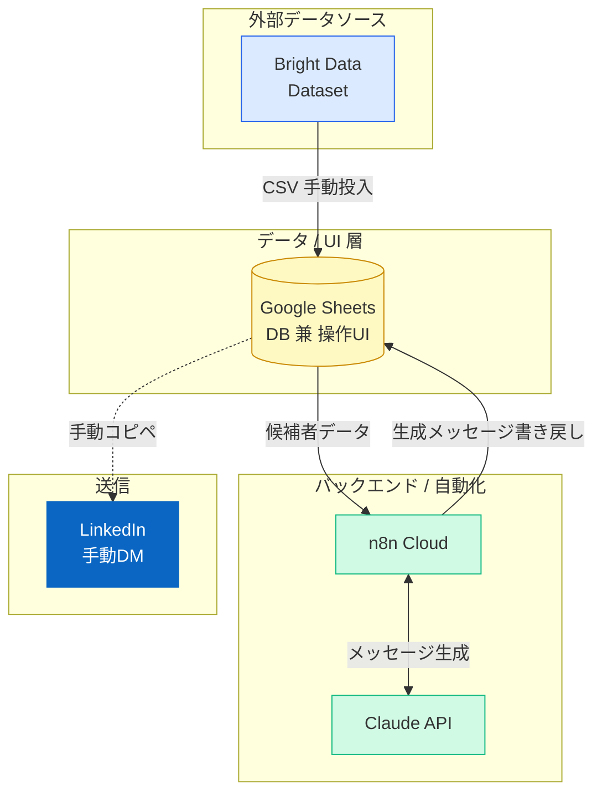
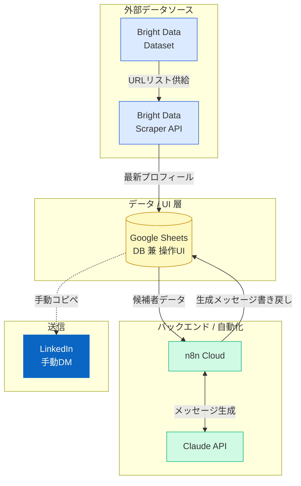
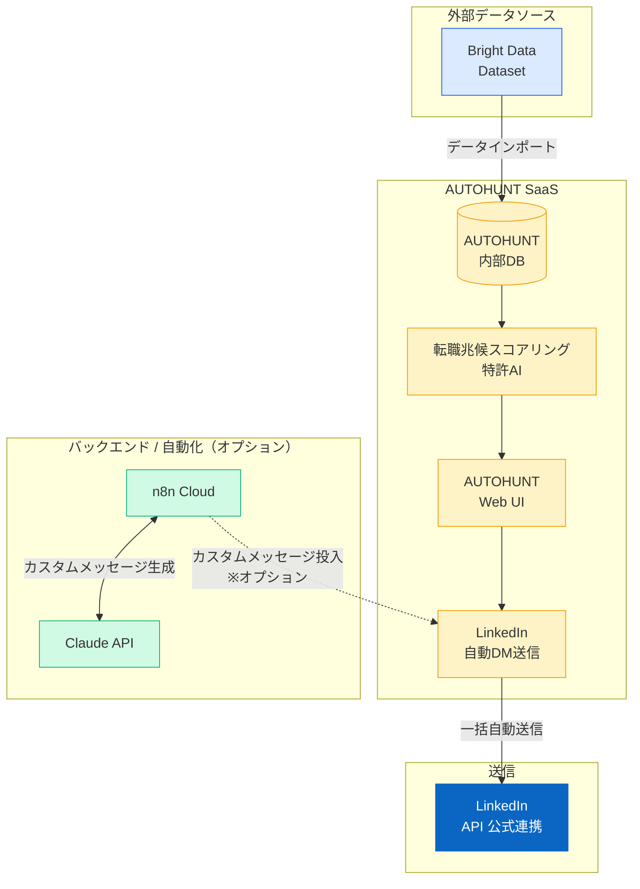
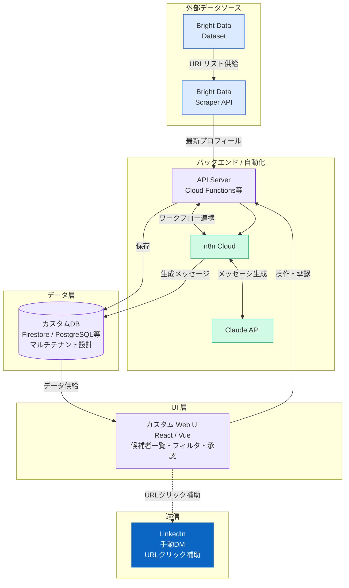
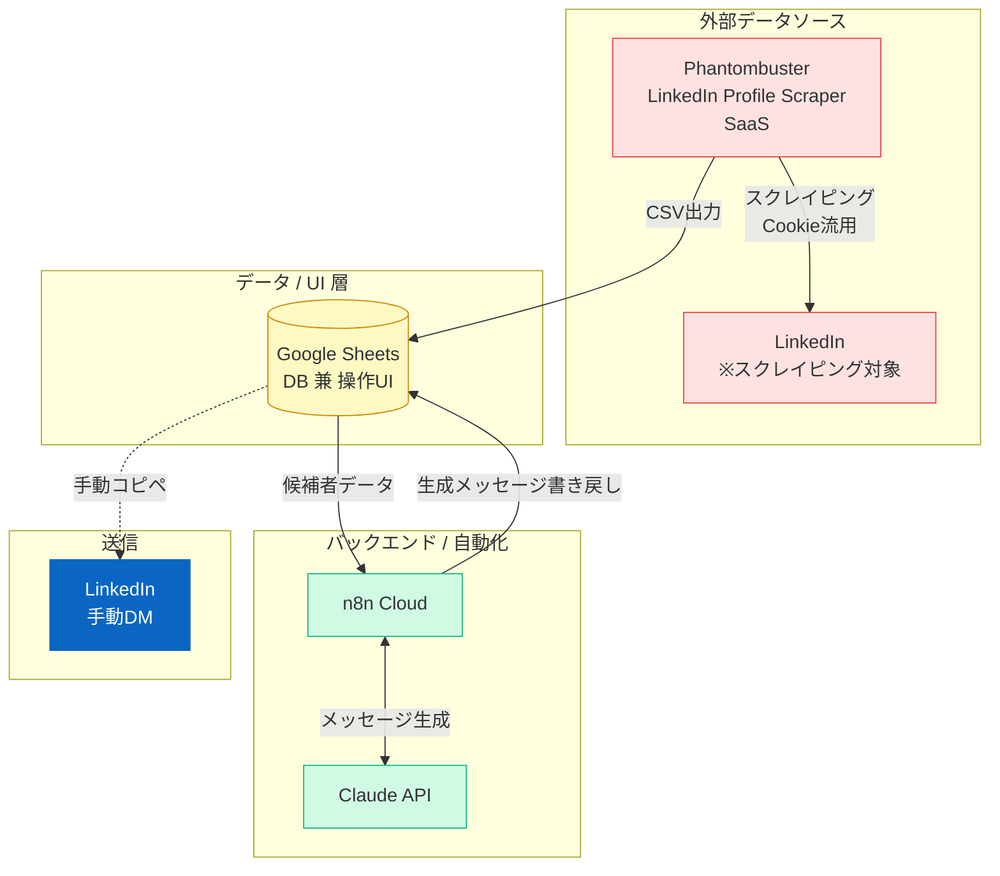
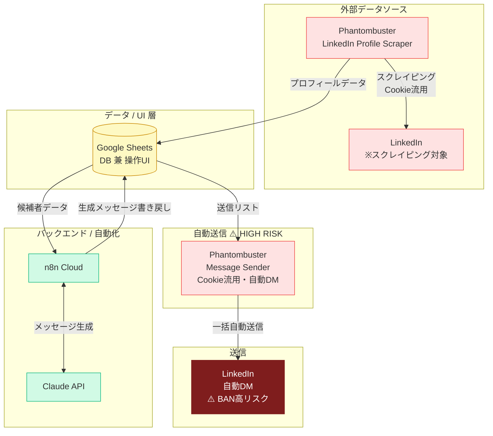

# LinkedIn追加機能 実装パターン システムアーキテクチャ比較

---

## パターン別 開発工数見積もり（人日）

> ※ 単価：12,500円/時間 ／ 1人日 = 8時間 = 10万円
> ※ ◯ = 該当あり ／ ✗ = 該当なし

| 作業項目 | A | B | C | D | E | F |
| **開発費見積もり** | **80〜120万** | **120〜180万** | **100〜150万** | **約1,000万** | **100〜150万** | **150〜200万** |

### 費用算出の根拠

- **A〜C / E〜F**：パターンA（11人日）= 80〜120万円を基準に工数比で換算
- **パターンD**：フルスタック開発（UI + API + DB + インフラ）のため別途積み上げ。約1,000万円前後
- パターンCはAUTOHUNT連携の仕様確認コスト込みのため、工数比より若干高め設定

### 留意事項

- **パターンC**はAUTOHUNT側の仕様・API提供範囲により工数が変動。連携方法の確認が必要。
- **パターンD**はフルスタック開発のため、複数エンジニアの並行作業を前提とする。
- **パターンF**はBAN対策・レート制限の実装を含むため、安全設計の分だけF > Eとなる。
- 上記はhomulaの標準開発スピードを前提とした概算。要件確定後に再見積もりが必要。

---

## アーキテクチャ比較表

| 項目 | A | B | C | D | E | F |
|---|---|---|---|---|---|---|
| **〈データソース〉** | | | | | | |
| 外部データ取得 | BD Dataset (CSV) | BD Dataset + Scraper API | BD Dataset | BD Dataset + Scraper API | PB LinkedIn Scraper | PB LinkedIn Scraper |
| 差分更新 | ✗ 手動再購入 | ✓ URL指定取得 (¥0.23/件) | ✓ AUTOHUNT内部 | ✓ URL指定取得 (¥0.23/件) | ✓ 定期スクレイプ | ✓ 定期スクレイプ |
| **〈データ層〉** | | | | | | |
| DB / ストレージ | Google Sheets | Google Sheets | AUTOHUNT内部DB | カスタムDB (Firestore等) | Google Sheets | Google Sheets |
| マルチテナント対応 | ✗ | ✗ | △ AH側 | ✓ 独自設計 | ✗ | ✗ |
| **〈バックエンド〉** | | | | | | |
| カスタムサーバー | なし | なし | なし | ✓ 要 (Cloud Functions等) | なし | なし |
| ワークフロー自動化 | n8n Cloud | n8n Cloud | AUTOHUNT (+ n8n) | n8n Cloud | n8n Cloud | n8n Cloud |
| AI / メッセージ生成 | Claude API | Claude API | AH AI + Claude (opt) | Claude API | Claude API | Claude API |
| **〈UI層〉** | | | | | | |
| 操作画面 | Google Sheets | Google Sheets | AUTOHUNT Web UI | カスタム Web UI (React等) | Sheets + PB UI | Sheets + PB UI |
| カスタムUI開発 | ✗ | ✗ | ✗ | ✓ フルスタック | ✗ | ✗ |
| **〈DM送信〉** | | | | | | |
| 送信方式 | 手動 | 手動 | AUTOHUNT自動 | 手動 (URL補助付) | 手動 | PB自動 ⚠️ |
| LinkedIn API連携 | なし | なし | AH公式連携 | なし | Cookie流用 | Cookie流用 |
| **〈カスタム開発範囲〉** | | | | | | |
| 開発スコープ | n8nフロー | n8nフロー | n8nフロー (最小) | UI + API + n8nフロー | n8nフロー | n8nフロー |
| **〈外部SaaS依存〉** | | | | | | |
| 使用SaaS | BD | BD | BD + AUTOHUNT | BD | Phantombuster | Phantombuster |
| ToSリスク | 低 | 低 | 低〜中 | 低 | 中 (グレー) | 高 (BAN risk) |

---

## パターンA〜Fのシステムアーキテクチャ図

---

## パターンA — BD / Dataset のみ

**一括購入・買い切り（差分更新なし）**

**カスタム開発スコープ：n8nワークフロー のみ**

---

## パターンB — BD / Dataset + Scraper API

**初回購入 ＋ URL指定差分更新**

**カスタム開発スコープ：n8nワークフロー のみ**

---

## パターンC — BD + AUTOHUNT 連携

**AUTOHUNT SaaSによるスコアリング + 自動DM**

**カスタム開発スコープ：AHインポート設定 + n8nワークフロー（オプション）**

---

## パターンD — BD / Dataset + Scraper API + カスタムフロント

**差分更新あり ＋ 専用Web UI（マルチテナント対応）**

**カスタム開発スコープ：Web UI + API Server + DB設計 + n8nワークフロー（フルスタック）**

---

## パターンE — Phantombuster / スクレイピングのみ

**PBでデータ収集 + n8nでメッセージ生成（DM送信は手動）**

> ⚠️ **リスク**：LinkedIn ToS グレーゾーン。レート制限遵守で実運用BANリスクは管理可能。

**カスタム開発スコープ：n8nワークフロー のみ**

---

## パターンF — Phantombuster / DM自動送信（PoC）

**PBでスクレイピング〜DM送信まで自動化（BAN・ToSリスク高）**

> 🚨 **HIGH RISK**：LinkedIn ToS 違反。週100件超でアカウント停止。T3メインアカウントでの本番利用不可。PoC・テスト用途限定。

**カスタム開発スコープ：n8nワークフロー のみ**

---

## パターン比較サマリー

| | A | B | C | D | E | F |
|---|:---:|:---:|:---:|:---:|:---:|:---:|
| データソース | BD Dataset | BD Dataset + Scraper | BD + AUTOHUNT | BD Dataset + Scraper | Phantombuster | Phantombuster |
| 差分更新 | ✗ | ✓ | ✓ | ✓ | ✓ | ✓ |
| DM送信 | 手動 | 手動 | 自動（AH） | 手動 | 手動 | 自動（PB）⚠️ |
| 専用UI | ✗ | ✗ | AH UI | ✓ Web UI | ✗ | ✗ |
| カスタムDB | ✗ | ✗ | ✗ | ✓ | ✗ | ✗ |
| カスタムサーバー | ✗ | ✗ | ✗ | ✓ | ✗ | ✗ |
| マルチテナント | ✗ | ✗ | △ | ✓ | ✗ | ✗ |
| ToSリスク | 低 | 低 | 低〜中 | 低 | 中 | 高 |

---

## パターン別 費用の根拠とスコープ管理ポイント

> n8nによるメッセージ生成部分は既存実装を流用するため、各パターンの工数差は「それ以外の部分」で生まれます。

---

### パターンA — 80〜120万円

**工数の主な要因**

n8nメッセージ生成が流用できるため、実質的な新規開発は少ない。費用の大半は初期セットアップと品質担保に集中する。

- BDのDataset購入・CSV取り込みフォーマットの設計と実装
- Google Sheetsのデータ構造設計（候補者管理・フィルタ・承認欄）
- n8nフローのカスタマイズ（既存流用＋クライアント固有ロジックの調整）
- 動作検証・UAT支援

**スコープを絞るべき箇所**

| 項目 | 膨らみやすいポイント | 推奨スコープ |
|---|---|---|
| スプシのフィルタ条件 | 条件が多いほど設計・テストが増える | 初期は3〜5条件に絞る |
| 承認フローのステップ数 | 多段階承認はスプシでは複雑になる | 1段階（最終承認のみ）を推奨 |
| CSV取り込みの自動化 | 完全自動化は別途工数が必要 | v1は手動投入でスタート |

---

### パターンB — 120〜180万円

**工数の主な要因**

AとのコストÅは主にScraper API連携の実装に起因する。URLリストの管理・差分更新のスケジューリング・エラーハンドリングが新規開発となる。

- Bright Data Scraper APIの認証・リクエスト実装
- URLリスト管理ロジック（どのURLをいつ更新するかの設計）
- 差分更新スケジューラーの構築（定期実行・失敗時リトライ）
- 取得データの正規化・スプシへの書き戻し
- Scraper API特有のエラー（レートリミット・タイムアウト）ハンドリング

**スコープを絞るべき箇所**

| 項目 | 膨らみやすいポイント | 推奨スコープ |
|---|---|---|
| 更新頻度・スケジュール | 細かな条件分岐（対象者によって頻度を変えるなど）は複雑 | 全URL一律・週1回更新でスタート |
| エラー通知の作り込み | Slack通知・メール通知・再試行ロジックの組み合わせ | 失敗ログのスプシ書き出しのみ |
| URLリストの自動管理 | 追加・削除・重複排除の自動化は工数大 | v1はT3担当者が手動でリスト管理 |

---

### パターンC — 100〜150万円

**工数の主な要因**

開発工数はAと近い水準だが、AUTOHUNT側の仕様確認・調整コストが乗る。AUTOHUNTがどこまでAPIを公開しているかで工数が大きく変動するため、費用に幅がある。

- BDデータのAUTOHUNTインポート用フォーマット設計・変換処理
- AUTOHUNT側の設定（フィルタ条件・スコアリング設定・送信テンプレート）
- カスタムメッセージ生成をn8n/Claudeで行う場合の連携実装（オプション）
- AUTOHUNTとのインテグレーションテスト・本番確認

**スコープを絞るべき箇所**

| 項目 | 膨らみやすいポイント | 推奨スコープ |
|---|---|---|
| メッセージ生成 | AHテンプレートとn8n/Claudeを両立させようとすると複雑 | どちらか一方に統一する |
| AH設定のカスタマイズ | スコアリング条件・フィルタの細かい調整はAH側工数 | 標準機能の範囲内で運用開始 |
| インポート頻度・自動化 | 自動定期インポートは別途実装が必要 | v1は手動インポートでスタート |

---

### パターンD — 約1,000万円前後

**工数の主な要因**

他パターンと桁が異なる理由は、フルスタックWebアプリケーションの開発が必要になるためです。UI・APIサーバー・DB・インフラの4層すべてをゼロから構築します。n8nメッセージ生成は流用できますが、それ以外はほぼ新規開発です。

- **UI開発（最大の工数）**：候補者一覧画面・フィルタ機能・承認画面・ダッシュボード等
- **APIサーバー構築**：フロントとn8n・DB・Scraper APIをつなぐ中間層
- **DB設計・構築**：マルチテナント対応のスキーマ設計、候補者データの保存・更新ロジック
- **インフラ構築**：Cloud Functions / Firebase / Vercel等の環境構築・デプロイパイプライン
- **認証・テナント管理**：クライアントごとのデータ分離、ログイン機能

**スコープを絞るべき箇所**

このパターンは「画面数×機能数」が費用を直接左右します。要件定義時に以下を明確に絞り込むことが最重要です。

| 項目 | 膨らみやすいポイント | 推奨スコープ |
|---|---|---|
| **画面数** | 管理画面・設定画面・ダッシュボードなど追加要望が増えやすい | v1は候補者一覧・承認・設定の3画面のみ |
| **フィルタ機能** | 条件の組み合わせ・保存・共有などで工数が倍増 | 固定フィルタ5条件のみ。動的フィルタはv2以降 |
| **承認フロー** | 複数人承認・差し戻し・コメント機能は設計が複雑 | 1クリック承認のみ。差し戻しなし |
| **マルチテナント設計** | テナントごとのカスタム設定・権限管理は工数大 | v1はテナント切り替えのみ。権限はAdmin固定 |
| **通知機能** | メール・Slack・プッシュ通知などは各々実装コストがかかる | v1はUI上のステータス表示のみ |
| **データエクスポート** | CSV・PDF等の出力機能は別途工数 | v1は対象外 |

---

### パターンE — 100〜150万円

**工数の主な要因**

n8nメッセージ生成が流用できる点はAと同じ。AとのコストÅはPhantombusterのセットアップ・テストと、スクレイピングデータの品質検証にある。BDと異なりデータ品質にばらつきがあるため、データクレンジングの工数が乗る。

- Phantombusterアカウント設定・LinkedIn Profile Scraper設定
- スクレイピング条件（検索クエリ・対象属性）の設計と検証
- 取得データのクレンジング・正規化（欠損・フォーマット崩れ対応）
- スプシへの取り込みフォーマット設計
- レート制限・スクレイピング頻度の安全設定

**スコープを絞るべき箇所**

| 項目 | 膨らみやすいポイント | 推奨スコープ |
|---|---|---|
| データクレンジング | 取得データの品質次第でクレンジング工数が変動 | 最低限の正規化のみ。欠損は許容 |
| スクレイピング条件の数 | 複数の検索クエリを並行管理すると複雑 | 1クライアントにつき1検索条件でスタート |
| 実行スケジュール | 複数タイミング・条件分岐は複雑 | 週1回の定時実行のみ |

---

### パターンF — 150〜200万円

**工数の主な要因**

Eに加えて自動DM送信の実装が加わる。自動送信はLinkedInアカウントへの影響が大きいため、BANリスクを抑えるための安全設計（レート制限・送信間隔・停止ロジック）に工数がかかる。

- Phantombuster Message Senderの設定・テスト
- 送信レート制限ロジック（1日あたりの上限・インターバル設定）
- 異常検知時の自動停止ロジック（エラー率が閾値超で停止）
- テスト環境（別LinkedInアカウント）での動作検証
- 本番移行前の段階的送信テスト（少数→段階的に増量）

**スコープを絞るべき箇所**

| 項目 | 膨らみやすいポイント | 推奨スコープ |
|---|---|---|
| 安全停止ロジック | 細かな条件分岐（エラー種別ごとの対応）は工数大 | シンプルな閾値超過で全停止のみ |
| 送信条件のカスタマイズ | 候補者属性ごとに送信内容・タイミングを変える場合は複雑 | v1は全候補者に同一設定 |
| 監視・アラート | Slack通知・ダッシュボードなどの監視機能 | v1はn8n実行ログの確認のみ |
