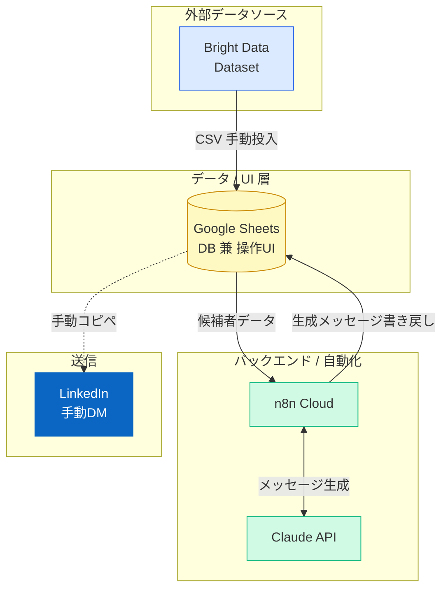
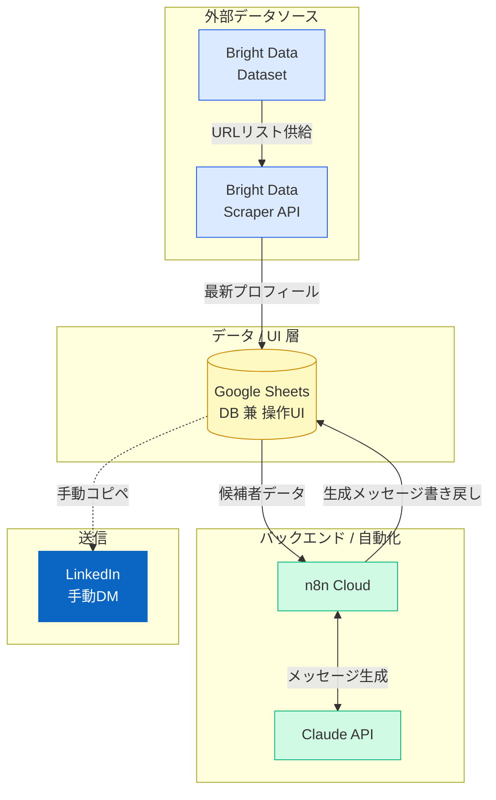
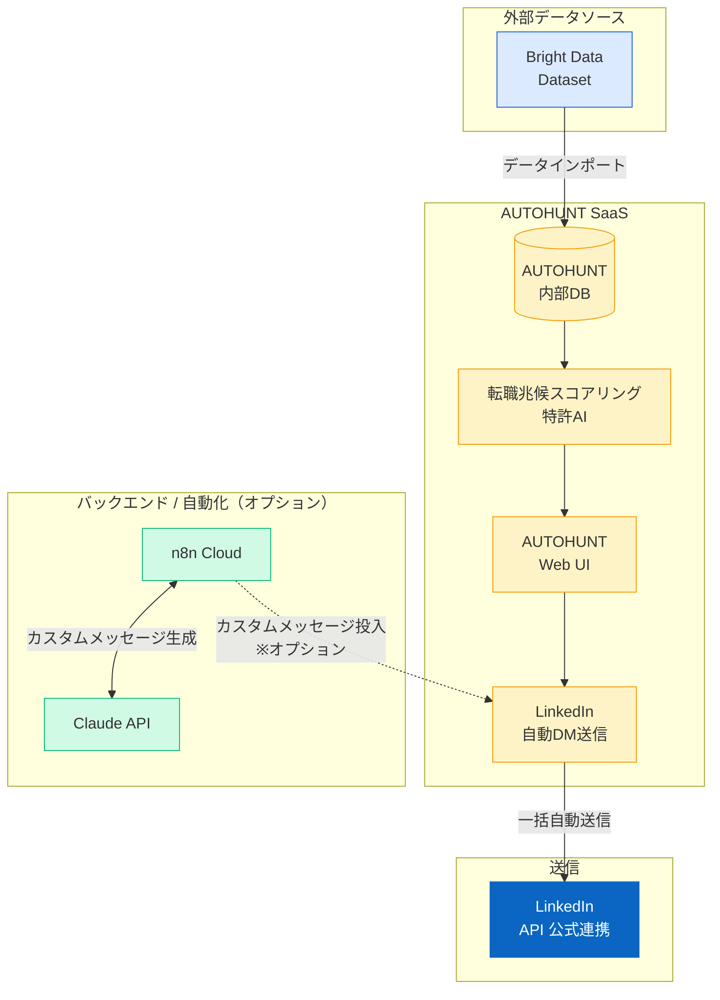
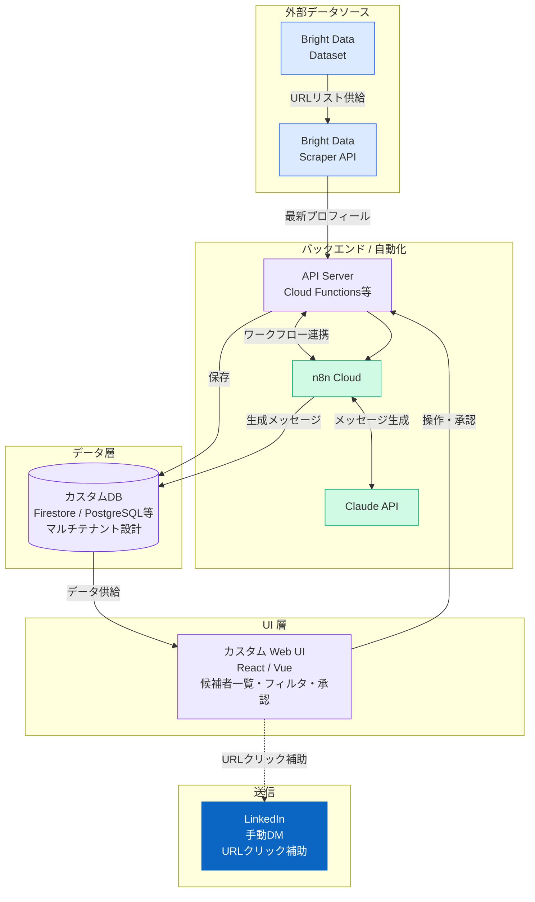
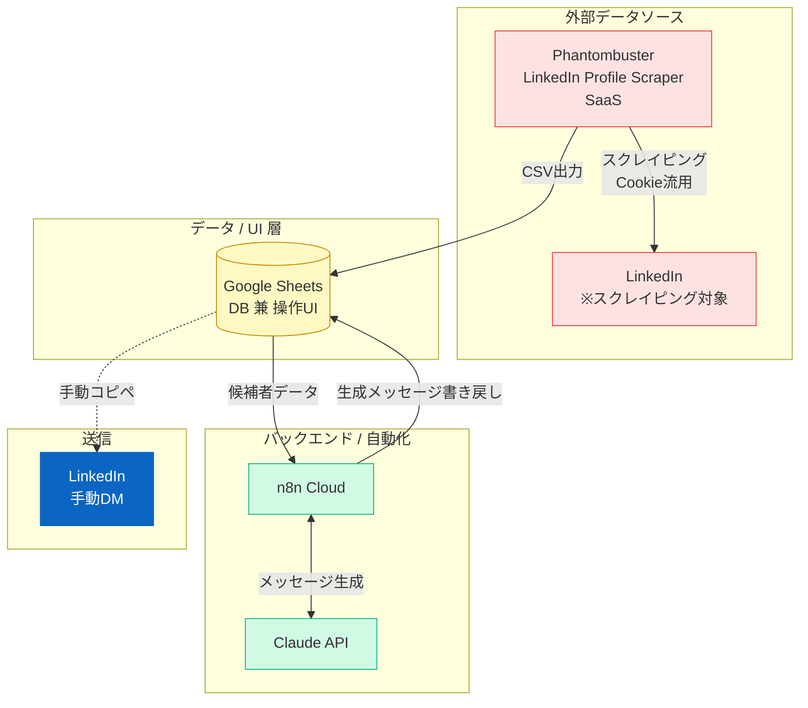
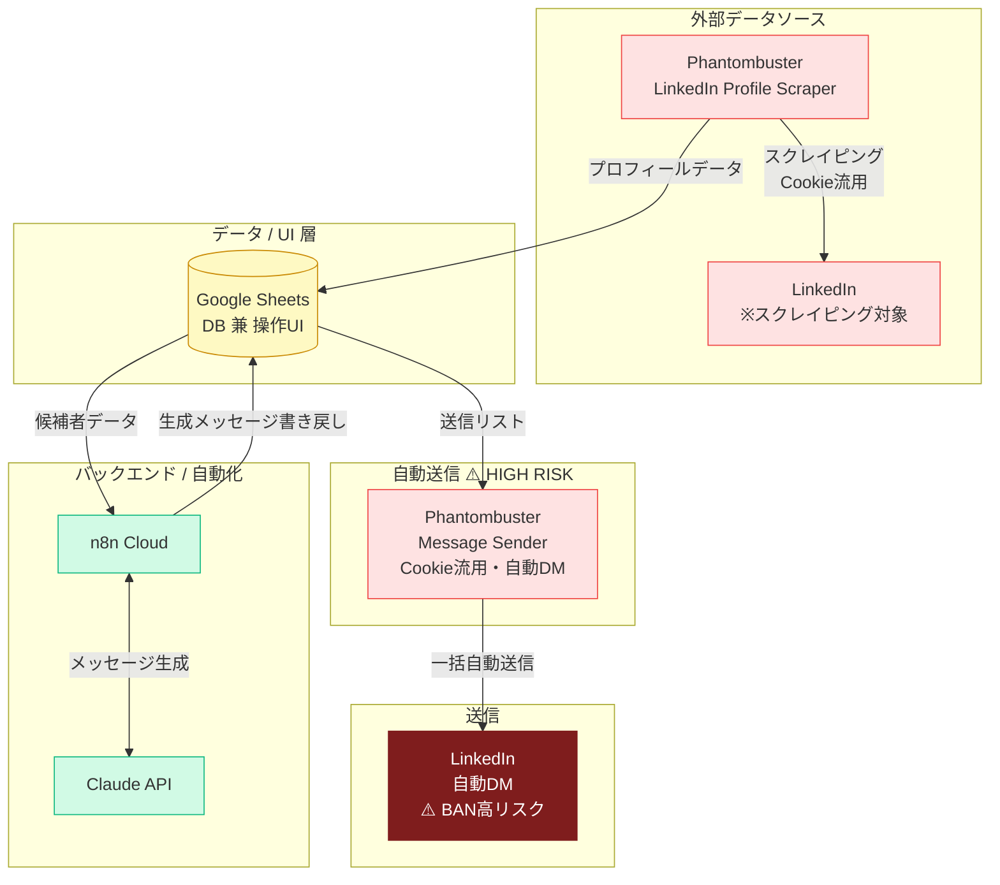

# LinkedIn追加機能 実装パターン システムアーキテクチャ比較

---

## アーキテクチャ比較表

| 項目 | A | B | C | D | E | F |
|---|---|---|---|---|---|---|
| **〈データソース〉** | | | | | | |
| 外部データ取得 | BD Dataset (CSV) | BD Dataset + Scraper API | BD Dataset | BD Dataset + Scraper API | PB LinkedIn Scraper | PB LinkedIn Scraper |
| 差分更新 | ✗ 手動再購入 | ✓ URL指定取得 (¥0.23/件) | ✓ AUTOHUNT内部 | ✓ URL指定取得 (¥0.23/件) | ✓ 定期スクレイプ | ✓ 定期スクレイプ |
| **〈データ層〉** | | | | | | |
| DB / ストレージ | Google Sheets | Google Sheets | AUTOHUNT内部DB | カスタムDB (Firestore等) | Google Sheets | Google Sheets |
| マルチテナント対応 | ✗ | ✗ | △ AH側 | ✓ 独自設計 | ✗ | ✗ |
| **〈バックエンド〉** | | | | | | |
| カスタムサーバー | なし | なし | なし | ✓ 要 (Cloud Functions等) | なし | なし |
| ワークフロー自動化 | n8n Cloud | n8n Cloud | AUTOHUNT (+ n8n) | n8n Cloud | n8n Cloud | n8n Cloud |
| AI / メッセージ生成 | Claude API | Claude API | AH AI + Claude (opt) | Claude API | Claude API | Claude API |
| **〈UI層〉** | | | | | | |
| 操作画面 | Google Sheets | Google Sheets | AUTOHUNT Web UI | カスタム Web UI (React等) | Sheets + PB UI | Sheets + PB UI |
| カスタムUI開発 | ✗ | ✗ | ✗ | ✓ フルスタック | ✗ | ✗ |
| **〈DM送信〉** | | | | | | |
| 送信方式 | 手動 | 手動 | AUTOHUNT自動 | 手動 (URL補助付) | 手動 | PB自動 ⚠️ |
| LinkedIn API連携 | なし | なし | AH公式連携 | なし | Cookie流用 | Cookie流用 |
| **〈カスタム開発範囲〉** | | | | | | |
| 開発スコープ | n8nフロー | n8nフロー | n8nフロー (最小) | UI + API + n8nフロー | n8nフロー | n8nフロー |
| **〈外部SaaS依存〉** | | | | | | |
| 使用SaaS | BD | BD | BD + AUTOHUNT | BD | Phantombuster | Phantombuster |
| ToSリスク | 低 | 低 | 低〜中 | 低 | 中 (グレー) | 高 (BAN risk) |

---

## パターンA〜Fのシステムアーキテクチャ図

---

## パターンA — BD / Dataset のみ

**一括購入・買い切り（差分更新なし）**

**カスタム開発スコープ：n8nワークフロー のみ**

---

## パターンB — BD / Dataset + Scraper API

**初回購入 ＋ URL指定差分更新**

**カスタム開発スコープ：n8nワークフロー のみ**

---

## パターンC — BD + AUTOHUNT 連携

**AUTOHUNT SaaSによるスコアリング + 自動DM**

**カスタム開発スコープ：AHインポート設定 + n8nワークフロー（オプション）**

---

## パターンD — BD / Dataset + Scraper API + カスタムフロント

**差分更新あり ＋ 専用Web UI（マルチテナント対応）**

**カスタム開発スコープ：Web UI + API Server + DB設計 + n8nワークフロー（フルスタック）**

---

## パターンE — Phantombuster / スクレイピングのみ

**PBでデータ収集 + n8nでメッセージ生成（DM送信は手動）**

> ⚠️ **リスク**：LinkedIn ToS グレーゾーン。レート制限遵守で実運用BANリスクは管理可能。

**カスタム開発スコープ：n8nワークフロー のみ**

---

## パターンF — Phantombuster / DM自動送信（PoC）

**PBでスクレイピング〜DM送信まで自動化（BAN・ToSリスク高）**

> 🚨 **HIGH RISK**：LinkedIn ToS 違反。週100件超でアカウント停止。T3メインアカウントでの本番利用不可。PoC・テスト用途限定。

**カスタム開発スコープ：n8nワークフロー のみ**

---

## パターン比較サマリー

| | A | B | C | D | E | F |
|---|:---:|:---:|:---:|:---:|:---:|:---:|
| データソース | BD Dataset | BD Dataset + Scraper | BD + AUTOHUNT | BD Dataset + Scraper | Phantombuster | Phantombuster |
| 差分更新 | ✗ | ✓ | ✓ | ✓ | ✓ | ✓ |
| DM送信 | 手動 | 手動 | 自動（AH） | 手動 | 手動 | 自動（PB）⚠️ |
| 専用UI | ✗ | ✗ | AH UI | ✓ Web UI | ✗ | ✗ |
| カスタムDB | ✗ | ✗ | ✗ | ✓ | ✗ | ✗ |
| カスタムサーバー | ✗ | ✗ | ✗ | ✓ | ✗ | ✗ |
| マルチテナント | ✗ | ✗ | △ | ✓ | ✗ | ✗ |
| ToSリスク | 低 | 低 | 低〜中 | 低 | 中 | 高 |
