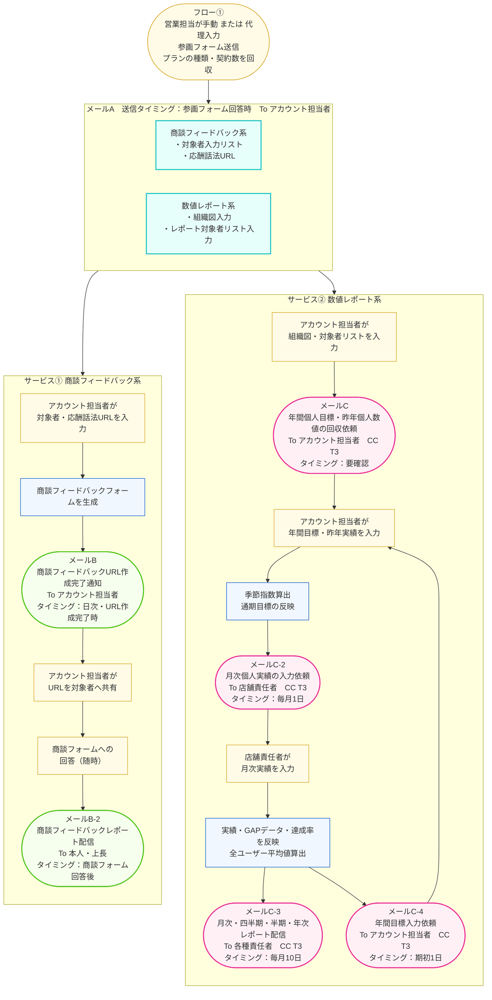

# 営業フィードバックAIエージェント 初期登録フロー

---

## メール一覧

| メール名 | メールで通知する内容 | 宛先 | タイミング |
|---|---|---|---|
| メールA | ①商談FB系：対象者入力リスト・応酬話法URL ②数値レポート系：組織図入力・レポート対象者リスト入力 | アカウント担当者 | 参画フォーム回答時 |
| メールB | 商談フィードバックURL作成完了通知 | アカウント担当者 | 日次起動・URL作成完了時 |
| メールB-2 | 商談フィードバックレポート | 本人 / 上長 | 商談フォーム回答後・フィードバック生成完了時 |
| メールC | 年間個人目標の回収依頼、昨年個人数値の回収依頼 | アカウント担当者（CC: T3） | 要確認 |
| メールC-2 | 月次個人実績の入力依頼 | 店舗責任者（CC: T3） | 毎月1日 |
| メールC-3 | 月次・四半期・半期・年次レポート完成通知 | 各種責任者（CC: T3） | 毎月10日 |
| メールC-4 | 年間目標入力依頼 | アカウント担当者（CC: T3） | 期初1日 |
