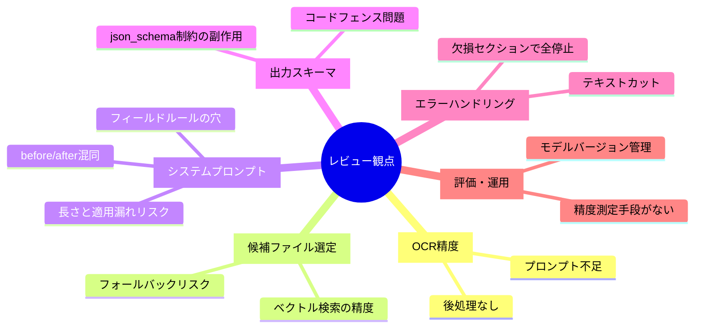
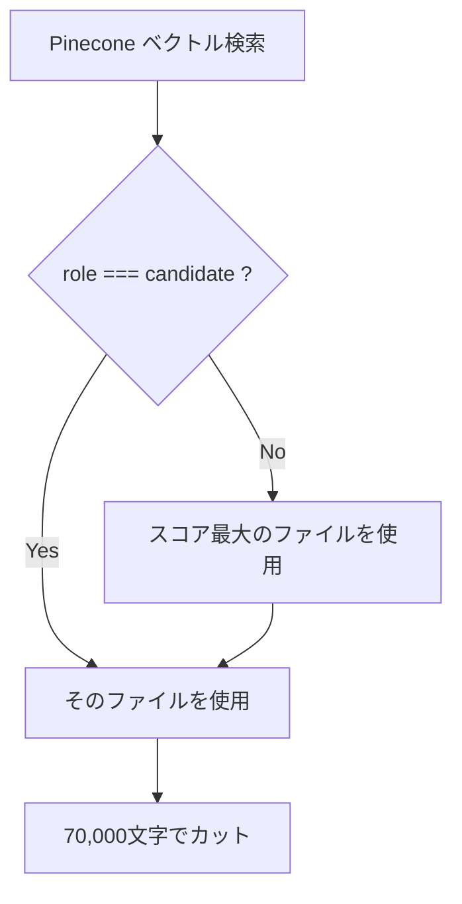
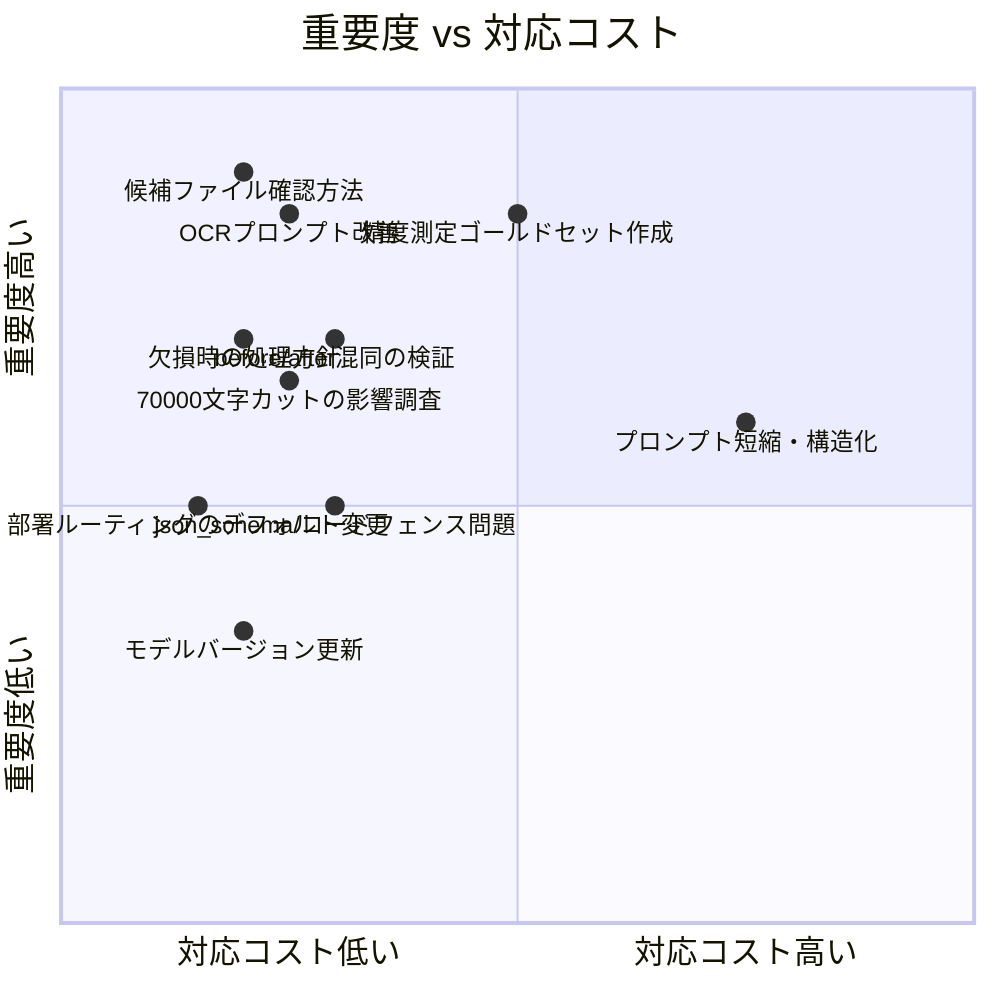

# AI生成精度レビュー会 — 確認・指摘事項リスト

> Agent 2 (カシワ).json を対象としたプロンプト改善検討用資料

---

## レビューの全体構造



---

## 問題1：OCRプロンプトが極めて薄い（高優先）

### 現状

```
OCRして抽出テキストだけ返してください。
```

これだけ。船舶仕様書は以下のような複雑なレイアウトを持つ。

### リスク

| レイアウト要素 | 現状の挙動 | 影響 |
|---|---|---|
| 複数列の表 | 列が崩れて1列に混在する可能性 | 数値の行ずれ → 比較誤り |
| ヘッダー・フッター（ページ番号、書類番号） | 本文テキストに混入する | ノイズとして差分誤検知 |
| 図・グラフ内のテキスト | 抽出できないかランダムに抽出 | 値の欠落 |
| 二段組レイアウト | 左右が混在する | 文脈破壊 |

### 確認すべきこと

- 実際のOCR出力テキストを目視確認したことがあるか
- 表が崩れた状態で後段のClaude比較に渡っていないか
- mistral-ocr の代わりに `pdf` パーサー（構造保持）を試したか

### 改善候補プロンプト例

```
このPDFを正確にOCRしてください。
- 表は | 区切りのテキスト表として再現してください
- ヘッダー・フッター（ページ番号、文書番号）は除外してください
- 図中のテキストのみ抽出し、図の説明は不要です
- 抽出テキストのみを返し、説明・コメントは一切不要です
```

---

## 問題2：候補ファイル選定の信頼性（高優先）

### 現状の選定ロジック



### リスク①：間違った候補ファイルが選ばれた場合、全差分が無意味になる

- ベクトル類似度が高くても「同じ部署・同じ機器カテゴリ」とは限らない
- 比較結果のどこにも「どのファイルと比較したか」は表示されるか？

### リスク②：`role === "candidate"` の設定根拠が不明

- どのノードが `role: "candidate"` を付与しているか
- 複数候補がある場合の選定基準はスコアのみか

### 確認すべきこと

- 候補選定ミスが過去に起きたか（起きても気づけるか）
- 差分レポートに「比較元ファイル名」「類似度スコア」を表示しているか
- 類似度スコアの閾値はあるか（低スコア候補をそもそも弾く仕組み）

---

## 問題3：70,000文字カットによる情報欠落（高優先）

### 現状コード

```javascript
new_document:      cap(newItem.new_text, 70000),
candidate_document: cap(candidate.text,   70000),
```

### リスク

- 長い仕様書では**後半にある比較項目が切り捨てられる**
- 「（記載なし）」と出力されても、実際はカットされているだけの可能性
- 現状、カットが発生したかどうかをモデルは知らない

### 確認すべきこと

- 実際の仕様書は何文字程度か（OCR後テキスト）
- 70,000文字を超えることがあるか
- どの比較項目が文書の後半に出てくるか

### 改善候補

- カット発生時にシステムプロンプトへ `[注: 文書は70,000文字で打ち切られています]` を挿入
- 比較項目に関連するチャンクだけをPineconeで検索して渡す（RAG方式）

---

## 問題4：システムプロンプトの長さと適用漏れリスク（中優先）

### 現状

フィールド別抽出ルールだけで約3,000〜4,000トークン。全体では5,000トークン超と推定。

### リスク

| 問題 | 内容 |
|---|---|
| 後半ルールの適用漏れ | LLMは長いプロンプトの後半を見落としやすい |
| ルール間の矛盾 | 多数のルールが共存するため、矛盾が生じても気づきにくい |
| 保守性 | 新フィールド追加時に既存ルールとの整合確認が困難 |

### 確認すべきこと

- 各フィールド別ルールの適用精度を個別に測定したことがあるか
- 特にプロンプト後半に記載されているフィールド（`メインパネルはCCR/ECR？`、`放水塔`等）の精度が低くないか

---

## 問題5：before/after の混同（中優先）

### 根拠

システムプロンプトに以下の繰り返し強調がある。

```
IMPORTANT FIELD ASSIGNMENT RULES (must follow strictly):
- Never swap before and after. before = old, after = new.
```

これは**過去に実際に混同が発生した**ことを示唆する。

### 確認すべきこと

- 現在も混同は解消されているか、それとも発生率が下がっただけか
- `Parse JSON Result` ノードで before/after の自動検証（例：同じ内容なら `no_change`）はあるが、**逆になっていること自体は検知できない**
- レポートを見た人間が逆転を指摘したケースはあるか

### 改善候補

- 出力後に「造船所名などの固定フィールドで before と after のどちらが新ファイルか」を機械的に検証するバリデーションノードを追加

---

## 問題6：`stripCodeFences` 関数の存在（中優先）

### 現状コード（Parse JSON Result）

```javascript
function stripCodeFences(s) {
  return s.replace(/^```(?:json)?\s*/i, "").replace(/\s*```$/i, "").trim();
}
```

### 問題

`response_format: json_schema` を指定しているにもかかわらず、コードフェンス除去処理が必要 = **Claudeがマークダウン形式で返すことがある**。

### 確認すべきこと

- json_schema指定時にコードフェンスが付いてくる頻度はどれくらいか
- OpenRouter経由の場合、json_schema が正しく機能しているか（OpenRouter側のサポート状況）
- エラーログにJSON parse失敗がどれくらい出ているか

---

## 問題7：欠損セクションで全ワークフロー停止（中優先）

### 現状コード（Parse JSON Result）

```javascript
if (missing.length) {
  throw new Error("Model output is missing priority sections: " + missing.join(", "));
}
```

### リスク

比較項目が1つでも欠落すると**ワークフロー全体がエラー停止**する。Excelもアップロードされない。

### 確認すべきこと

- このエラーはどこに通知されるか（Teams通知はあるか）
- エラー停止の頻度はどれくらいか
- 欠落した項目だけ `（抽出失敗）` と出力して処理継続するほうが業務的に望ましくないか

---

## 問題8：部署ルーティングの不明デフォルト（低優先）

### 現状コード（Priority Compare Items Config）

```javascript
} else {
  // safe default
  priorityItems = LISTS.dept2;
}
```

### リスク

- 部署不明の場合に**設計第二部のリスト（イナートガス系）**が使われる
- 設計第三部の仕様書が誤判定されると、全く関係ない項目で比較される
- 「safe default」というコメントだが、実際にはサイレントに誤った比較が行われる

### 確認すべきこと

- 部署判定に失敗したケースは実際にあったか
- デフォルトでエラーを出す、または人間に確認を求めるほうが安全では

---

## 問題9：精度を測る仕組みがない（高優先・運用観点）

### 現状

精度確認は**人間の目視のみ**と推定される。

### リスク

| 問題 | 影響 |
|---|---|
| 精度低下に気づけない | モデルアップデートやデータ変化で静かに劣化 |
| 改善効果が測れない | プロンプト変更の前後比較ができない |
| 個別フィールドの精度が不明 | どのフィールドが弱いか分からない |

### 確認すべきこと

- 過去の出力と正解データ（人間が確認したもの）を対応付けて保存しているか
- フィールド別の正答率を計算したことがあるか
- 少なくとも10〜20件のゴールドセットを作れるか

---

## 問題10：モデルバージョン管理（低優先）

### 現状

```javascript
const model = "anthropic/claude-sonnet-4.5";
```

### リスク

- OpenRouter経由のため、モデルの実際の挙動がAnthropicの直接APIと異なる可能性
- モデルがアップデートされた場合の挙動変化の把握手段がない
- `claude-sonnet-4.5` → `claude-sonnet-4.6` へのアップデートで精度向上の可能性

---

## レビュー会 議題優先順位



---

## レビュー会 アジェンダ案

| # | 議題 | 所要時間 | ゴール |
|---|---|---|---|
| 1 | **実際のOCR出力の目視確認** | 15分 | 表崩れ・ノイズの有無を確認 |
| 2 | **候補ファイルの選定精度確認** | 15分 | 誤選定が起きているかを過去ログで検証 |
| 3 | **before/after逆転の再現テスト** | 10分 | 現バージョンでも発生するか確認 |
| 4 | **欠損セクション時の方針決定** | 10分 | エラー停止 vs 部分出力の業務判断 |
| 5 | **ゴールドセット作成の合意** | 10分 | 何件・どのフィールドを正解データ化するか |
| 6 | **改善優先順位の合意** | 10分 | 上記を踏まえた対応ロードマップ |

---

## 持参・事前準備資料

- [ ] 実際のOCR出力テキスト（PDFと並べて確認できる形で）
- [ ] 過去の差分レポート出力（Excelファイル）と元の仕様書PDFの対応
- [ ] エラーログ（欠損セクションエラーの発生件数）
- [ ] 仕様書PDFの平均文字数（OCR後テキスト）
