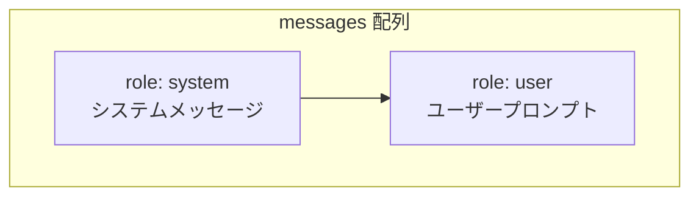
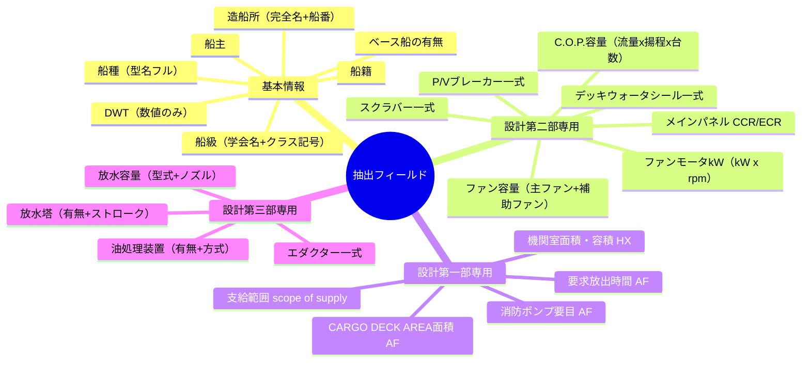
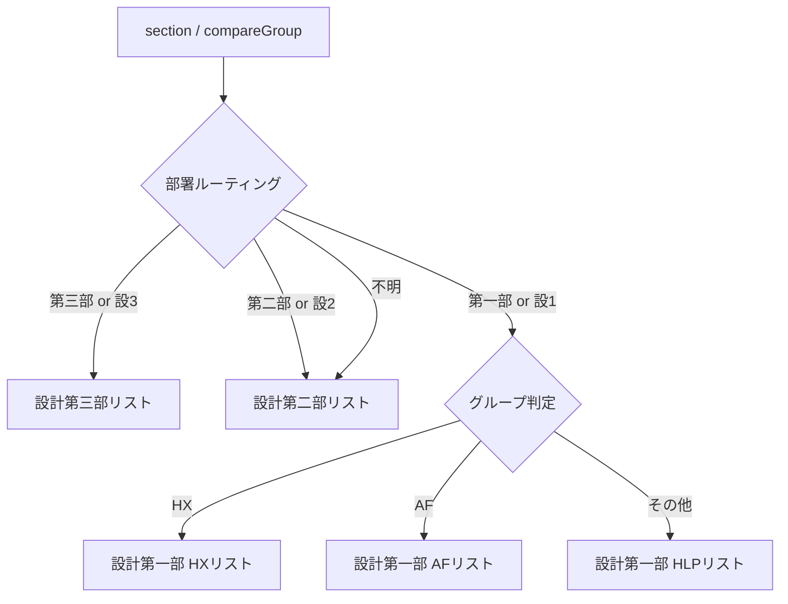
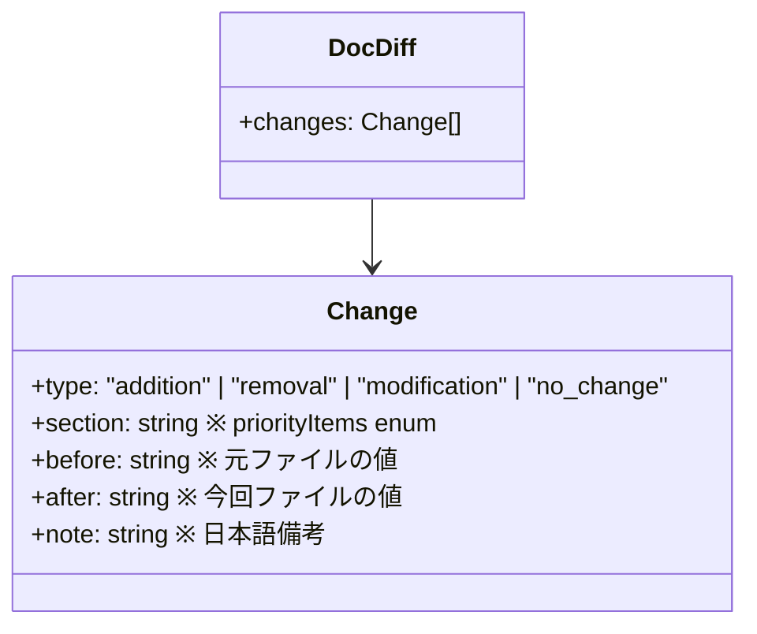
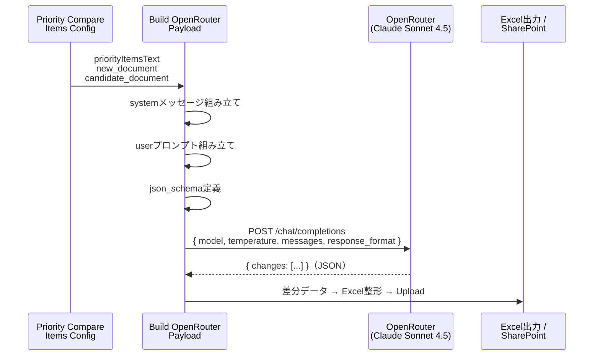

# Build OpenRouter Payload — プロンプト設計ドキュメント

> Agent 2 (カシワ).json の `Build OpenRouter Payload`（Codeノード）が組み立てるプロンプトの全体像

---

## 1. ノードの位置づけ


`Build OpenRouter Payload` は直前の `Priority Compare Items Config` が決定した比較項目リストを受け取り、Claude への HTTP リクエストボディを JSON で組み立てる。

---

## 2. 使用モデル・パラメータ

| 項目 | 値 |
|---|---|
| **モデル** | `anthropic/claude-sonnet-4.5`（OpenRouter経由） |
| **temperature** | `0`（決定論的・再現性重視） |
| **レスポンス形式** | `json_schema`（構造化出力） |

---

## 3. メッセージ構成



---

## 4. システムメッセージ（全文）

### 4-1. 役割定義

```
You are a document comparison assistant.
```

### 4-2. GOAL（目的）

```
Compare NEW DOCUMENT vs CANDIDATE DOCUMENT only for the PRIORITY ITEMS LIST.
```

### 4-3. フィールド割り当てルール（厳守）

```
- "before" must ALWAYS contain the value from CANDIDATE DOCUMENT.
- "after"  must ALWAYS contain the value from NEW DOCUMENT.
- CANDIDATE DOCUMENT = 元ファイル = old version
- NEW DOCUMENT       = 今回ファイル = new version
- Never swap before and after. before = old, after = new.
```

### 4-4. OUTPUT RULES（出力ルール）

```
- Return ONLY raw JSON（no markdown, no code fences）
- Only report differences that relate to the PRIORITY ITEMS LIST
- Output diffs in the same order as the PRIORITY ITEMS LIST (top to bottom)
- For PRIORITY ITEMS: always output every item regardless of whether there is a difference
  - 差異なし → 分類: "変更なし", 旧値・新値ともに実際の値を入れる
  - 記載なし  → "（記載なし）"
- type: "no_change" の場合も before/after を出力すること
- 各 diff に "note"（日本語・約25文字）を付ける
  - 数値・単位があれば差分/増減率を計算する
  - 例: "容量10%増加", "冗長性向上", "MED認証必要", "新規要求", "選択肢削除"
```

### 4-5. TEXT RULES（テキスト処理ルール）

| ルール | 内容 |
|---|---|
| 言語 | `section`, `before`, `after` は原文コピー。`note` は日本語 |
| 空白正規化 | "船 種"・"船　種"・"船種" はすべて同一フィールドとして扱う |

### 4-6. フィールド別抽出ルール（主要項目）



---

## 5. ユーザープロンプト テンプレート

```
PRIORITY ITEMS LIST (most important first):
{priorityItemsText}   ← Priority Compare Items Config が生成

NEW DOCUMENT (今回ファイル・新バージョン):
{new_document}        ← OCR済みテキスト

CANDIDATE DOCUMENT (元ファイル・旧バージョン):
{candidate_document}  ← 類似ファイルのOCRテキスト
```

---

## 6. 部署別 優先比較項目リスト

`priorityItemsText` は `Priority Compare Items Config` ノードが部署・グループに応じて動的に切り替える。



### 設計第一部 — HLP（デフォルト）

1. 造船所
2. ベース船の有無
3. 船級
4. 船種
5. DWT(積載重量トン)
6. 船主
7. 船籍
8. 消火対象機器の型式・寸法・数量
9. 機関室無人化or非無人化

### 設計第一部 — HX

1. 造船所
2. ベース船の有無
3. 船級
4. 船種
5. DWT(積載重量トン)
6. 船主
7. 船籍
8. 機関室の面積・容積
9. 機関室以外の保護区画の有無（ある場合は面積・容積）
10. 支給範囲(scope of supply)

### 設計第一部 — AF

1. 造船所
2. ベース船の有無
3. 船級
4. 船種
5. DWT(積載重量トン)
6. 船主
7. 船籍
8. CARGO DECK AREAの面積
9. 支給範囲(scope of supply)
10. 要求放出時間（イナートガス装置の有無）
11. 消防ポンプの要目

### 設計第二部

1. 造船所
2. 船番
3. イナートガス容量
4. 船級
5. 計画年度/POS発行年度
6. 船主
7. 船籍（MED該当するか否かも）
8. 船種
9. DWT(積載重量トン)
10. C.O.P.容量
11. ファン（容量：イナートガス容量に対する%-50 or 100及びその台数）
12. ファンモータkW
13. スクラバー一式
14. デッキウォータシール一式
15. P/Vブレーカー一式（有無）
16. メインパネルはCCR/ECR？

### 設計第三部

1. 造船所
2. 船番
3. 放水容量（放水砲型式＋ノズル型式）
4. 放水塔（有無とストローク）
5. エダクター一式
6. 油処理装置（有無と方式）

---

## 7. レスポンス JSONスキーマ（構造化出力）

`response_format` に `json_schema` を指定し、Claude の出力を以下の構造に強制する。

```json
{
  "changes": [
    {
      "type": "addition | removal | modification | no_change",
      "section": "<priorityItems の enum から選択>",
      "before": "<CANDIDATE DOCUMENT の値>",
      "after": "<NEW DOCUMENT の値>",
      "note": "<日本語備考 約25文字>"
    }
  ]
}
```



---

## 8. データフロー全体図



---

## 9. 設計上のポイント

| 観点 | 内容 |
|---|---|
| **temperature=0** | 同じ入力なら必ず同じ出力。監査・再現性を重視 |
| **json_schema強制** | `section` を enum 制約することで、優先項目リスト外の出力を防止 |
| **変更なしも全件出力** | `no_change` でも before/after を出力し、Excelで全項目確認できる |
| **空白正規化ルール** | OCRの揺れ（"船 種" vs "船種"）に対応。抽出漏れを防ぐ |
| **note の計算ルール** | 数値フィールドは差分・増減率を自動計算させ、Excel備考を自動生成 |
