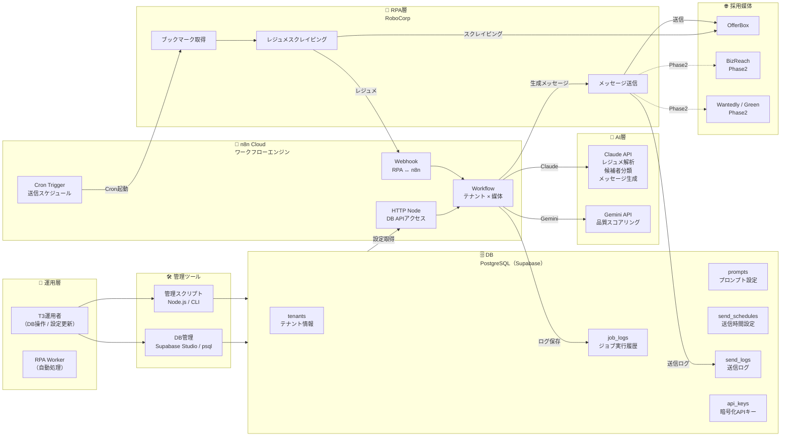

```mermaid
%% ============================================================
%% T3 Recruit Automation — 全体アーキテクチャ図（DB運用 / フロント無し）
%% ============================================================

flowchart LR

    %% ── 運用者 ──
    subgraph USER["👤 運用層"]
        direction TB
        U1["T3運用者\n（DB操作 / 設定更新）"]
        U2["RPA Worker\n（自動処理）"]
    end

    %% ── 管理ツール ──
    subgraph ADMIN["🛠️ 管理ツール"]
        direction TB
        A1["DB管理\nSupabase Studio / psql"]
        A2["管理スクリプト\nNode.js / CLI"]
    end

    %% ── DB ──
    subgraph DB["🗄️ DB\nPostgreSQL（Supabase）"]
        direction TB
        DB1["tenants\nテナント情報"]
        DB2["prompts\nプロンプト設定"]
        DB3["send_schedules\n送信時間設定"]
        DB4["job_logs\nジョブ実行履歴"]
        DB5["send_logs\n送信ログ"]
        DB6["api_keys\n暗号化APIキー"]
    end

    %% ── n8n ──
    subgraph N8N["🔄 n8n Cloud\nワークフローエンジン"]
        direction TB
        N1["Workflow\nテナント × 媒体"]
        N2["Cron Trigger\n送信スケジュール"]
        N3["Webhook\nRPA ↔ n8n"]
        N4["HTTP Node\nDB APIアクセス"]
    end

    %% ── AI ──
    subgraph AI["🤖 AI層"]
        direction TB
        AI1["Claude API\nレジュメ解析\n候補者分類\nメッセージ生成"]
        AI2["Gemini API\n品質スコアリング"]
    end

    %% ── RPA ──
    subgraph RPA["🤖 RPA層\nRoboCorp"]
        direction TB
        R1["ブックマーク取得"]
        R2["レジュメスクレイピング"]
        R3["メッセージ送信"]
    end

    %% ── 採用媒体 ──
    subgraph MEDIA["🌐 採用媒体"]
        direction TB
        M1["OfferBox"]
        M2["BizReach\nPhase2"]
        M3["Wantedly / Green\nPhase2"]
    end

    %% ── 接続 ──
    U1 --> A1
    U1 --> A2

    A1 --> DB
    A2 --> DB

    DB -->|設定取得| N4
    N4 --> N1

    N2 -->|Cron起動| R1

    R1 --> R2
    R2 -->|レジュメ| N3
    N3 --> N1

    N1 -->|Claude| AI1
    N1 -->|Gemini| AI2

    N1 -->|生成メッセージ| R3

    R2 -->|スクレイピング| M1
    R3 -->|送信| M1

    R3 -.->|Phase2| M2
    R3 -.->|Phase2| M3

    N1 -->|ログ保存| DB4
    R3 -->|送信ログ| DB5
```
